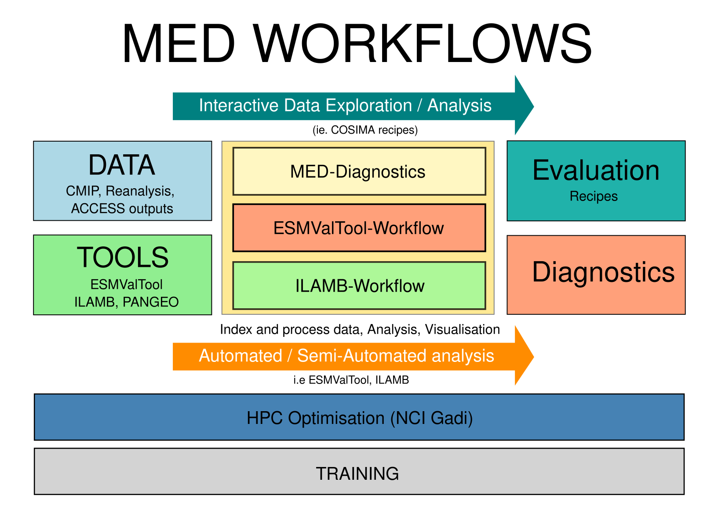
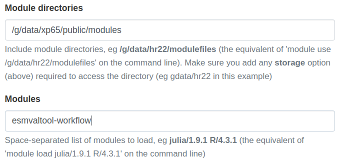
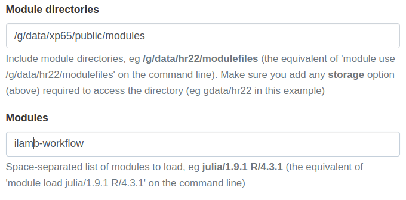

<p align="center">
  
</p>

## The Model Evaluation and Diagnostics (MED) Team is Here to Help!

We support **infrastructure** (software + data) and provide **technical support / training** to the **ACCESS community**.

- **Tool Deployment on NCI Gadi:** We make sure essential tools like ESMValTool and ILAMB are ready to go on NCI Gadi, so your research workflows run smoothly.

- **Evaluation Tools & Recipes:** We develop, support, and fine-tune evaluation tools and scripts, ensuring they're up to scratch.

- **Publication & Dissemination:** Need to get your work out there? We assist with publishing and sharing your evaluation scripts.

- **Training:** Whether you're a newbie or a pro, we offer training for all levels to help you make the most of our tools and resources.

- **Community Hub:** We're your go-to for collaboration and knowledge-sharing, keeping the ACCESS ecosystem thriving.

If you need support, the MED team is here to help!

## ACCESS-NRI Evaluation tools and infrastructure

Here is the current list of tools and supporting infrastructure under the ACCESS-NRI Model Evaluation and Diagnostics team responsibility: 

- MED Conda Environments  
- ESMValTool-Workflow 
- ILAMB-Workflow 
- ACCESS MED Diagnostics 
- ACCESS-NRI Intake catalogue 
- ACCESS-NRI Data Replicas for Model Evaluation and Diagnostics 

### MED Conda Environments 

To ensure effective and efficient evaluation of model outputs, it is crucial to have a well-maintained and reliable analysis environment on the NCI Gadi supercomputer. Our approach involves releasing tools within containerized Conda environments, providing a consistent and dependable platform for users. These containerized environments simplify the deployment process, ensuring that all necessary dependencies and configurations are included, which minimizes setup time and potential issues.

### ESMValTool-Workflow

ESMValTool-workflow is the ACCESS-NRI software and data infrastructure that enables the ESMValTool evaluation framework on NCI Gadi. It includes:
- The ESMValCore Python packages: This core library is designed to facilitate the preprocessing of climate data, offering a structured and efficient way to handle complex datasets. 
- The ESMValTool collection of recipes, diagnostics and observation CMORisers.
- A data pool of CMORised observational datasets. 

ESMValTool-workflow is configured to use the existing NCI supported CMIP data collections.

ESMValTool meets the community's need for a robust, reliable, and reproducible framework to evaluate ACCESS climate models. Specifically developed with CMIP evaluation in mind, the software is well-suited for this purpose.

> ## How do I get started?
>
> The ESMValCore and ESMValTool python tools and their dependencies are deployed on Gadi within an ESMValTool-workflow containerized Conda environment that can be loaded as a module. 
> > ## Using the command line and PBS jobs
> > If you have carefully completed the requirements, you should already be a member of the `xp65` project and be ready to go.
> > 
> >```bash
> > module use /g/data/xp65/public/modules
> > # Load the ESMValTool-Workflow:
> > module load esmvaltool-workflow
> >```
> {: .solution}
> > ## Using ARE
> > If you have carefully completed the requirements, you should already be a member of the `xp65` project and be ready to go.
> > 
> > <p align="center">
> >  
> > </p>
> {: .solution}
{: .challenge}

### ILAMB-Workflow

The International Land Model Benchmarking (ILAMB) project is a model-data intercomparison and integration project designed to improve the performance of land models and, in parallel, improve the design of new measurement campaigns to reduce uncertainties associated with key land surface processes. 

The ACCESS-NRI Model Evaluation and Diagnostics team is releasing and supporting NCI configuration of ILAMB under the name ILAMB-workflow. 

ILAMB-workflow is the ACCESS-NRI software and data infrastructure that enables the ILAMB evaluation framework on NCI Gadi. It includes:
- the ILAMB Python packages
- a series of ILAMB outputs for ACCESS model evaluation and 
- the ILAMB-Data collection of observational datasets. 

ILAMB-workflow is configured to use the existing NCI supported CMIP data collections. 

ILAMB addresses the needs of the Land community for a robust, reliable, and reproducible framework for evaluating land surface models.

> ## How do I get started?
>
> The ILAMB python tool and its dependencies are deployed on Gadi within an ILAMB-workflow containerized Conda environment that can be loaded as a module. 
> > ## Using the command line and PBS jobs
> > If you have carefully completed the requirements, you should already be a member of the `xp65` project and be ready to go.
> > 
> >```bash
> > module use /g/data/xp65/public/modules
> > # Load the ILAMB-Workflow:
> > module load ilamb-workflow
> >```
> {: .solution}
> > ## Using ARE
> > If you have carefully completed the requirements, you should already be a member of the `xp65` project and be ready to go.
> > 
> > <p align="center">
> >  
> > </p>
> {: .solution}
{: .challenge}


