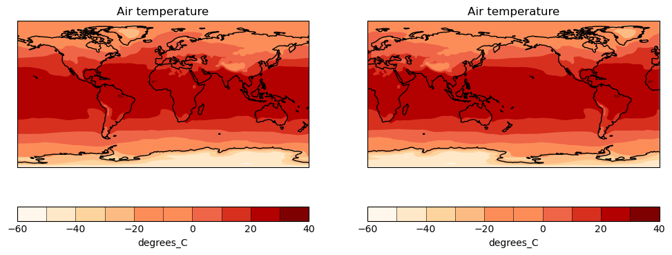

## What is ESMValTool?

This tutorial is a first introduction to ESMValTool. Before diving into the
technical steps, let's talk about what ESMValTool is all about.

> ## What is ESMValTool?
>
> What do you already know about or expect from ESMValTool?
>
> > ## ESMValTool is...
> >
> > EMSValTool is many things, but in this tutorial we will focus on the
> > following traits:
> >
> > &#10003; **A Python-based preprocessing framework**
> >
> > &#10003; **A Standardised framework for climate data analysis**
> >
> > &#10003; **A collection of diagnostics for reproducible climate science**
> >
> > &#10003; **A community effort**
> >
> {: .solution}
{: .challenge}

## A Python-based preprocessing framework

ESMValTool is powered by ESMValCore, a powerfull python-based workflow engine that facilitates CMIP analysis.
ESMValCore implements the core functionality of ESMValTool: it takes care of finding, opening, checking, fixing, concatenating, and preprocessing CMIP data and several other supported datasets.
ESMValCore has matured as a reliable foundation for the ESMValTool with recent addition making it attractive as a lightweight approach to CMIP evaluation.

A common scenario consist in visualising the global temperature of an historical run over a 2 year period.
To do so, you need first to:
- Find the data
- Extract the period of interest
- Calculate the mean
- Convert the units to degrees celsius
- Finally Plot the data

The following example illustrate how to leverage ESMValCore, the engine powering the ESMValTool collection of recipes, to quickly load CMIP data and do some analysis on them.

 ```python
 from esmvalcore.dataset import Dataset
 from esmvalcore.preprocessor import extract_time
 from esmvalcore.preprocessor import climate_statistics
 from esmvalcore.preprocessor import convert_units

 dataset = Dataset(
   short_name='tas',
   project='CMIP6',
   mip="Amon",
   exp="historical",
   ensemble="r1i1p1f1",
   dataset='ACCESS-ESM1-5',
   grid="gn"
)

 temperature = dataset.load()
 temperature_1990_1991 = extract_time(temperature, start_year=1990, start_month=1, start_day=1, end_year=1991, end_month=1, end_day=1) 
 temperature_weighted_mean = climate_statistics(temperature_1990_1991, operator="mean")
 temperature_celsius = convert_units(temperature_weighted_mean, units="degrees_C")
```

> ## Example Plots
>
> ESMValCore uses Iris Cube to manipulate data. Iris can thus be used to quickly plot the data in a notebook, but you could use your package of choice.
>
> ```python
>  import cartopy.crs as ccrs
>  import matplotlib.pyplot as plt
>  from matplotlib import colormaps
>  
>  import iris
>  import iris.plot as iplt
>  import iris.quickplot as qplt
>  
>  # Load a Cynthia Brewer palette.
>  brewer_cmap = colormaps["brewer_OrRd_09"]
>  
>  # Create a figure
>  plt.figure(figsize=(12, 5))
>  
>  # Plot #1: countourf with axes longitude from -180 to 180
>  proj = ccrs.PlateCarree(central_longitude=0.0)
>  plt.subplot(121, projection=proj)
>  qplt.contourf(temperature_weighted_mean, brewer_cmap.N, cmap=brewer_cmap)
>  plt.gca().coastlines()
>  
>  # Plot #2: contourf with axes longitude from 0 to 360
>  proj = ccrs.PlateCarree(central_longitude=-180.0)
>  plt.subplot(122, projection=proj)
>  qplt.contourf(temperature_weighted_mean, brewer_cmap.N, cmap=brewer_cmap)
>  plt.gca().coastlines()
>  iplt.show()
> ```
> 
>
{: .solution}

> ## Exercices
> ESMValCore has a growing collection of preprocessors, have a look at the documentation and see what is available. 
> - Open an ARE session and run the above example. 
> - See if you can load other datasets
> - change the time period
> - Add a new preprocessing step
{: .challenge}

## A Standardised framework for climate data analysis

ESMValTool is a software project that was designed by and for climate scientists to evaluate CMIP data in a standardized and reproducible manner. 

The central component of ESMValTool that we will see in this tutorial is the
**recipe**. Any ESMValTool recipe is basically a set of instructions to reproduce
a certain result. The basic structure of a recipe is as follows:

- **Documentation** with relevant (citation) information
- **Datasets** that should be analysed
- **Preprocessor** steps that must be applied
- **Diagnostic** scripts performing more specific evaluation steps

An example recipe could look like this:

```yaml
documentation:
  title: This is an example recipe.
  description: Example recipe
  authors:
    - lastname_firstname

datasets:
  - {dataset: ACCESS-CM2, project: CMIP6, exp: historical, mip: Amon, 
     ensemble: r1i1p1f1, start_year: 1960, end_year: 2005}

preprocessors:
  global_mean:
    area_statistics:
      operator: mean

diagnostics:
  average_plot:
    description: plot of global mean temperature change
    variables:
      temperature:
        short_name: tas
        preprocessor: global_mean
    scripts: examples/diagnostic.py
```

> ## Understanding the different section of the recipe
>
> Try to figure out the meaning of the different dataset keys. Hint: they can
> be found in the documentation of ESMValTool.
>
> > ## Solution
> > The keys are explained in the ESMValTool documentation, in the `Recipe 
> >  section `, under
> [datasets](https://docs.esmvaltool.org/projects/esmvalcore/en/latest/recipe/
overview.html#recipe-section-datasets)
> {: .solution}
{: .challenge}

## A collection of diagnostics for reproducible climate science

More than a tool, ESMValTool is a collection of publicly available recipes and
diagnostic scripts. This makes it possible to easily reproduce important
results.

> ## Explore the available recipes
>
> Go to the [ESMValTool Documentation webpage](https://docs.esmvaltool.org/) and
> explore the `Available recipes` section. Which recipe(s) would you like to
> try?
{: .challenge}

## A community effort

ESMValTool is built and maintained by an active community of scientists and
software engineers. It is an open source project to which anyone can contribute.
Many of the interactions take place on GitHub. Here, we briefly introduce you to
some of the most important pages.

> ## Meet the ESMValGroup
>
> Go to [github.com/ESMValGroup](https://github.com/ESMValGroup). This is
> the GitHub page of our 'organization'. Have a look around. How many collaborators are
> there? Do you know any of them?
>
> Near the top of the page there are 2 pinned repositories: ESMValTool and
> ESMValCore. Visit each of the repositories. How many people have contributed
> to each of them? Can you also find out how many people have contributed to
> this tutorial?
{: .challenge}

> ## Issues and pull requests
>
> Go back to the repository pages of
> [ESMValTool](https://github.com/ESMValGroup/ESMValTool) or
> [ESMValCore](https://github.com/ESMValGroup/ESMValCore). There are tabs for
> 'issues' and 'pull requests'. You can use the labels to navigate them a bit
> more. How many open issues are about enhancements of ESMValTool? And how many
> bugs have been fixed in ESMValCore? There is also an 'insights' tab, where you
> can see a summary of recent activity. How many issues have been opened and
> closed in the past month?
{: .challenge}

## Conclusion

This concludes the introduction of the tutorial. You now have a basic knowledge
of ESMValTool and its community. The following episodes will walk you through
the installation, configuration and running your first recipes.


