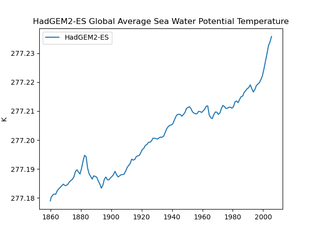
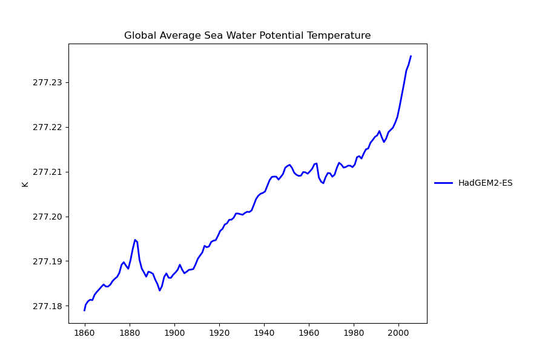

This episode describes how ESMValTool recipes work, how to run a recipe and how
to explore the recipe output. By the end of this episode, you should be able to
run your first recipe, look at the recipe output, modify a recipe, explore and
run some basic recipe debugging.

## Introduction to Recipes

Recipes are the instructions that you give to ESMValTool that tell it what you
want to do. This includes four main sections: datasets, preprocessors,
diagnostics and description.

  - datasets: what datasets you want to use, including
    - the time period and temporal resolution,
    - the MIP (Model Intercomparison Project, like atmospheric realm of MIP
      monthly data: Amon),
    - ensemble member,
    - the experiment (i.e. historical, ssp125, etc.),
    - and the grid type (necessary for CMIP6 only).

  - preprocessors: general operations applied to a dataset before handling it in
    a diagnostic, defining
    - which preprocessor modules to apply,
    - the order in which they are applied,
    - and the preprocessor arguments.

    This section can also be optional, if no preprocessing is needed.

  - diagnostics: all the information about the diagnostic, including
    - list of variables to evaluate (with their respective configurations),
    - the desired diagnostic script to use,
    - and additional diagnostic script options or arguments, if needed.

    It is possible to also include additional datasets beyond those included in
    the datasets section mentioned above, for instance variable specific
    observational data.

  - description: a brief description of the recipe, including
    - who wrote the recipe and who maintains it,
    - which project the recipe was written for,
    - and which publications and references are linked with the recipe.

    Note that the authors, publications and references need to be included in
    the `config-references.yml` for the recipe to run successfully.

The information you provide in the recipe is not only affecting the processes
you are starting, but also the directory names your output will be structured
in. For additional reads, please have a look at the recipe format description in
the [ESMValTool
manual](https://docs.esmvaltool.org/projects/esmvalcore/en/latest/recipe/overview.html#recipe-section-diagnostics).

## How to run ESMValTool

Once you’ve set up your conda environment and installed ESMValTool (see episode
#2 LINK) and set up your `config-user.yml` file to correctly match your local
environment, (see episode #3 LINK), ESMValTool is invoked using a simple
command:

~~~
esmvaltool -c configuration recipe
~~~
{: .source}

To try your hand with a basic recipe, please work through this episode.

## Introduction to the example recipe
The recipe presented here is a simple, basic recipe that takes a single dataset
and produces a time series plot.

Please download the following recipe into your ESMValTool working directory with
the name: recipe_example.yml LINK

> ## recipe_example.yml
> ```YAML
>  1    # ESMValTool
>  2    # recipe_example.yml
>  3    ---
>  4    documentation:
>  5      description: Demonstrate basic ESMValTool example
>  6
>  7      authors:
>  8        - demora_lee
>  9        - mueller_benjamin
> 10        - swaminathan_ranjini
> 11
> 12      maintainer:
> 13        - demora_lee
> 14
> 15      references:
> 16        - demora2018gmd
> 17        # Some plots also appear in ESMValTool paper 2.
> 18
> 19      projects:
> 20        - ukesm
> 21
> 22    datasets:
> 23      - {dataset: HadGEM2-ES, project: CMIP5, exp: historical, mip: Omon, ensemble: r1i1p1, start_year: 1859, end_year: 2005}
> 24
> 25    preprocessors:
> 26      prep_timeseries: # For 0D fields
> 27        annual_statistics:
> 28          operator: mean
> 29
> 30    diagnostics:
> 31      # --------------------------------------------------
> 32      # Time series diagnostics
> 33      # --------------------------------------------------
> 34      diag_timeseries_temperature:
> 35        description: simple_time_series
> 36        variables:
> 37          timeseries_variable:
> 38            short_name: thetaoga
> 39            preprocessor: prep_timeseries
> 40        scripts:
> 41          timeseries_diag:
> 42            script: ocean/diagnostic_timeseries.py
> ```
{: .solution}

> ## Explore the recipe
> Use the following command and investigate the sample recipe.
> ~~~bash
> vim  recipe_example.yml
> ~~~
{: .challenge}

Please note the following sections:

  - documentation: lines 4-20.
  The documentation consists of the following information:

    - description: a short description of the recipe
    - authors: a list of authors (linked to `esmvaltool/config-references.yml`)
    - maintainer: a list of maintainers (linked to `esmvaltool/config-references.yml`)
    - references: a list of references (linked to a bibtexfile in `esmvaltool/references` with the same name)
    - projects: a list of projects (linked to `esmvaltool/config-references.yml`)


  - datasets: lines 22-23

    The dataset definition consists of a list of python dictionaries with the
    information on the datasets.

    - dataset name (key: dataset)
    - project (key: project)
    - experiment (key: exp)
    - mip (for CMIP data, key: mip)
    - ensemble member (key: ensemble)
    - time range (e.g. key-value-pair: start_year: 1982, end_year: 1990)
    - model grid (for CMIP6 data only, key: grid)
    - alias (key: alias; use the alias for e.g. a more human readable name for
      the dataset)

  - preprocessors: lines 25-28

    The definition for different preprocessors or combinations. If no
    preprocessing is needed, the preprocessor can be set to an empty python
    dictionary (`{}`). Here, we produce annual means. The preprocessor is called
    with its name (here: prep_timeseries), later in the diagnostic (line 39).
    (See episode #5 LINK for more details.)

  - diagnostic section: lines 30-42

    The information of which diagnostic script to run with which variables. The
    diagnostics section has some indents that are free to call.

    - the first indent (here: diag_timeseries_temperature) is the diagnostic’s
      name (a string without whitespace), used for setting up the respective
      directories
    - description: a short description of the diagnostic
    - variables: a definition of all variables that are used in this diagnostic
    - the next indent (here: timeseries_variable) is the variables’ names (a
      string without whitespace) for the diagnostic to use
    - short_name: the variable name as listed in the dataset
    - preprocessor: the preprocessor(s) applied to the variable before running
      the diagnostic
    - scripts: a definition of all scripts that are used in this diagnostic
    - the next indent (here: timeseries_diag) is the scripts’ names (a string
      without whitespace) for the script to use
    - script: a executable script with a directory relative to the
      `esmvaltool/diag_scripts/` directory

> ## Please answer the following questions:
> What is the short_name of the variable being analyzed?
>
> What is the diagnostic script being used?
>
> How many years of data are being analyzed?
>
> What do you think running this recipe will produce?
{: .challenge}

> ## What is the short_name of the variable being analyzed?
> thetaoga -  Global Average Sea Water Potential Temperature
{: .solution}

> ## What is the diagnostic script being used?
> `ocean/diagnostic_timeseries.py`
{: .solution}

> ## How many years of data are being analyzed?
> 1859 to 2005, that is 147 years.
{: .solution}

> ## What do you think running this recipe will produce?
> A time series plot of thetaoga with increements of 1 year.
{: .solution}

> ## Not all parts of the recipe are mandatory
> Some functionalities of the example recipe are mandatory, while others are
> not. E.g., if you miss any of the documentation information, the call will
> break.
{: .callout}

> ## Running ESMValTool
>
> Use the command:
> ~~~bash
> esmvaltool run --config_file ./path_to_file/user-config.yml ./path_to_file/recipe_example.yml
> ~~~
>
> Follow the terminal guiding you through the subprocesses that are running. Can
> you find where the preprocessor and the diagnostic are starting? Which one
> took longer to process?
{: .challenge}

> ## Exemplary output
> ~~~bash
> 2020-07-01 08:22:58,571 UTC [33433] INFO
> ______________________________________________________________________
>           _____ ____  __  ____     __    _ _____           _
>          | ____/ ___||  \/  \ \   / /_ _| |_   _|__   ___ | |
>          |  _| \___ \| |\/| |\ \ / / _` | | | |/ _ \ / _ \| |
>          | |___ ___) | |  | | \ V / (_| | | | | (_) | (_) | |
>          |_____|____/|_|  |_|  \_/ \__,_|_| |_|\___/ \___/|_|
> ______________________________________________________________________
>
> ESMValTool - Earth System Model Evaluation Tool.
>
> http://www.esmvaltool.org
>
> CORE DEVELOPMENT TEAM AND CONTACTS:
>   Veronika Eyring (PI; DLR, Germany - veronika.eyring@dlr.de)
>   Bouwe Andela (NLESC, Netherlands - b.andela@esciencecenter.nl)
>   Bjoern Broetz (DLR, Germany - bjoern.broetz@dlr.de)
>   Lee de Mora (PML, UK - ledm@pml.ac.uk)
>   Niels Drost (NLESC, Netherlands - n.drost@esciencecenter.nl)
>   Nikolay Koldunov (AWI, Germany - nikolay.koldunov@awi.de)
>   Axel Lauer (DLR, Germany - axel.lauer@dlr.de)
>   Benjamin Mueller (LMU, Germany - b.mueller@iggf.geo.uni-muenchen.de)
>   Valeriu Predoi (URead, UK - valeriu.predoi@ncas.ac.uk)
>   Mattia Righi (DLR, Germany - mattia.righi@dlr.de)
>   Manuel Schlund (DLR, Germany - manuel.schlund@dlr.de)
>   Javier Vegas-Regidor (BSC, Spain - javier.vegas@bsc.es)
>   Klaus Zimmermann (SMHI, Sweden - klaus.zimmermann@smhi.se)
>
> For further help, please read the documentation at
> http://esmvaltool.readthedocs.io. Have fun!
>
> 2020-07-01 08:22:58,573 UTC [33433] INFO    Using config file /pf/b/b380506/work/config-DKRZ.yml
> 2020-07-01 08:22:58,573 UTC [33433] INFO    Writing program log files to:
> /scratch/b/b380506/recipe_example_20200701_082257/run/main_log.txt
> /scratch/b/b380506/recipe_example_20200701_082257/run/main_log_debug.txt
> 2020-07-01 08:22:58,574 UTC [33433] INFO    Starting the Earth System Model Evaluation Tool v2.0.0b9 at time: 2020-07-01 08:22:58 UTC
> 2020-07-01 08:22:58,574 UTC [33433] INFO    ----------------------------------------------------------------------
> 2020-07-01 08:22:58,574 UTC [33433] INFO    RECIPE   = /pf/b/b380506/work/recipes/recipe_example.yml
> 2020-07-01 08:22:58,575 UTC [33433] INFO    RUNDIR     = /scratch/b/b380506/recipe_example_20200701_082257/run
> 2020-07-01 08:22:58,575 UTC [33433] INFO    WORKDIR    = /scratch/b/b380506/recipe_example_20200701_082257/work
> 2020-07-01 08:22:58,575 UTC [33433] INFO    PREPROCDIR = /scratch/b/b380506/recipe_example_20200701_082257/preproc
> 2020-07-01 08:22:58,575 UTC [33433] INFO    PLOTDIR    = /scratch/b/b380506/recipe_example_20200701_082257/plots
> 2020-07-01 08:22:58,575 UTC [33433] INFO    ----------------------------------------------------------------------
> 2020-07-01 08:22:58,575 UTC [33433] INFO    Running tasks using at most 8 processes
> 2020-07-01 08:22:58,575 UTC [33433] INFO    If your system hangs during execution, it may not have enough memory for keeping this number of tasks in memory.
> 2020-07-01 08:22:58,575 UTC [33433] INFO    If you experience memory problems, try reducing 'max_parallel_tasks' in your user configuration file.
> 2020-07-01 08:22:58,607 UTC [33433] INFO    Creating tasks from recipe
> 2020-07-01 08:22:58,607 UTC [33433] INFO    Creating tasks for diagnostic diag_timeseries_temperature
> 2020-07-01 08:22:58,607 UTC [33433] INFO    Creating preprocessor task diag_timeseries_temperature/timeseries_variable
> 2020-07-01 08:22:58,608 UTC [33433] INFO    Creating preprocessor 'prep_timeseries' task for variable 'thetaoga'
> 2020-07-01 08:22:58,610 UTC [33433] INFO    Using input files for variable thetaoga of dataset HadGEM2-ES:
> /mnt/lustre01/work/kd0956/CMIP5/data/cmip5/output1/MOHC/HadGEM2-ES/historical/mon/ocean/Omon/r1i1p1/v20110916/thetaoga/thetaoga_Omon_HadGEM2-ES_historical_r1i1p1_185912-200512.nc
> 2020-07-01 08:22:58,617 UTC [33433] INFO    PreprocessingTask diag_timeseries_temperature/timeseries_variable created. It will create the files:
> /scratch/b/b380506/recipe_example_20200701_082257/preproc/diag_timeseries_temperature/timeseries_variable/CMIP5_HadGEM2-ES_Omon_historical_r1i1p1_thetaoga_1859-2005.nc
> 2020-07-01 08:22:58,617 UTC [33433] INFO    Creating diagnostic task diag_timeseries_temperature/timeseries_diag
> 2020-07-01 08:22:58,618 UTC [33433] INFO    These tasks will be executed: diag_timeseries_temperature/timeseries_variable, diag_timeseries_temperature/timeseries_diag
> 2020-07-01 08:22:58,621 UTC [33433] INFO    Running 2 tasks using 2 processes
> 2020-07-01 08:22:58,641 UTC [39196] INFO    Starting task diag_timeseries_temperature/timeseries_variable in process [39196]
> 2020-07-01 08:22:58,735 UTC [33433] INFO    Progress: 1 tasks running, 1 tasks waiting for ancestors, 0/2 done
> 2020-07-01 08:23:05,884 UTC [39196] INFO    Successfully completed task diag_timeseries_temperature/timeseries_variable (priority 0) in 0:00:07.241490
> 2020-07-01 08:23:05,963 UTC [33433] INFO    Progress: 0 tasks running, 1 tasks waiting for ancestors, 1/2 done
> 2020-07-01 08:23:05,969 UTC [39197] INFO    Starting task diag_timeseries_temperature/timeseries_diag in process [39197]
> 2020-07-01 08:23:05,975 UTC [39197] INFO    Running command ['/pf/b/b380506/miniconda3/envs/esmvaltool_pub/bin/python', '/mnt/lustre01/pf/b/b380506/work/GIT/ESMValTool/esmvaltool/diag_scripts/ocean/diagnostic_timeseries.py', '/scratch/b/b380506/recipe_example_20200701_082257/run/diag_timeseries_temperature/timeseries_diag/settings.yml']
> 2020-07-01 08:23:05,976 UTC [39197] INFO    Writing output to /scratch/b/b380506/recipe_example_20200701_082257/work/diag_timeseries_temperature/timeseries_diag
> 2020-07-01 08:23:05,976 UTC [39197] INFO    Writing plots to /scratch/b/b380506/recipe_example_20200701_082257/plots/diag_timeseries_temperature/timeseries_diag
> 2020-07-01 08:23:05,976 UTC [39197] INFO    Writing log to /scratch/b/b380506/recipe_example_20200701_082257/run/diag_timeseries_temperature/timeseries_diag/log.txt
> 2020-07-01 08:23:05,977 UTC [39197] INFO    To re-run this diagnostic script, run:
> cd /scratch/b/b380506/recipe_example_20200701_082257/run/diag_timeseries_temperature/timeseries_diag; MPLBACKEND="Agg" /pf/b/b380506/miniconda3/envs/esmvaltool_pub/bin/python /mnt/lustre01/pf/b/b380506/work/GIT/ESMValTool/esmvaltool/diag_scripts/ocean/diagnostic_timeseries.py /scratch/b/b380506/recipe_example_20200701_082257/run/diag_timeseries_temperature/timeseries_diag/settings.yml
> 2020-07-01 08:23:06,064 UTC [33433] INFO    Progress: 1 tasks running, 0 tasks waiting for ancestors, 1/2 done
> 2020-07-01 08:23:13,312 UTC [39197] INFO    Maximum memory used (estimate): 0.2 GB
> 2020-07-01 08:23:13,313 UTC [39197] INFO    Sampled every second. It may be inaccurate if short but high spikes in memory consumption occur.
> 2020-07-01 08:23:13,316 UTC [39197] WARNING No provenance information was written to /scratch/b/b380506/recipe_example_20200701_082257/run/diag_timeseries_temperature/timeseries_diag/diagnostic_provenance.yml
> 2020-07-01 08:23:13,316 UTC [39197] INFO    Successfully completed task diag_timeseries_temperature/timeseries_diag (priority 1) in 0:00:07.347165
> 2020-07-01 08:23:13,380 UTC [33433] INFO    Progress: 0 tasks running, 0 tasks waiting for ancestors, 2/2 done
> 2020-07-01 08:23:13,380 UTC [33433] INFO    Successfully completed all tasks.
> 2020-07-01 08:23:13,395 UTC [33433] INFO    Ending the Earth System Model Evaluation Tool v2.0.0b9 at time: 2020-07-01 08:23:13 UTC
> 2020-07-01 08:23:13,395 UTC [33433] INFO    Time for running the recipe was: 0:00:14.820802
> 2020-07-01 08:23:14,283 UTC [33433] INFO    Maximum memory used (estimate): 0.7 GB
> 2020-07-01 08:23:14,284 UTC [33433] INFO    Sampled every second. It may be inaccurate if short but high spikes in memory consumption occur.
> 2020-07-01 08:23:14,286 UTC [33433] INFO    Run was successful
> ~~~
{: .solution}

Each time you run the ESMValTool, it will produce a new output directory within
your specified work directory with the name of the recipe and the tagged
runtime. This folder should contain four folders:
  - run
  - work
  - preproc
  - plots

> ## Inspect the output:
> Now that you have run the esmvaltool command for the first time, please locate
> your output directory. If you’re missing the preproc directory, then your
> config-user.yml file has the value remove_preproc_dir set to true (this is
> used to save disk space). Please set this value to false and run the recipe
> again.
>
{: .challenge}

> ## Inspect specific files:
> Please locate and inspect the following files:
> - Your output plot(s).
> - Your main output log file.
> - Your settings.yml file.
> - A metadata.yml file.
> - The diagnostic log file.
{: .checklist}

Exemplary output (depending on the directory paths and package versions that are
available) can be found below. Note that the timestamps differ.

> ## Your output plot(s).
> Plot for the dataset(s):
>
> 
>
> Overlay plot, if multiple datasets are defined:
>
> 
{: .solution}

> ## Your main output log file.
> ~~~bash
> INFO    [33433]
> ______________________________________________________________________
>           _____ ____  __  ____     __    _ _____           _
>          | ____/ ___||  \/  \ \   / /_ _| |_   _|__   ___ | |
>          |  _| \___ \| |\/| |\ \ / / _` | | | |/ _ \ / _ \| |
>          | |___ ___) | |  | | \ V / (_| | | | | (_) | (_) | |
>          |_____|____/|_|  |_|  \_/ \__,_|_| |_|\___/ \___/|_|
> ______________________________________________________________________
>
> ESMValTool - Earth System Model Evaluation Tool.
>
> http://www.esmvaltool.org
>
> CORE DEVELOPMENT TEAM AND CONTACTS:
>   Veronika Eyring (PI; DLR, Germany - veronika.eyring@dlr.de)
>   Bouwe Andela (NLESC, Netherlands - b.andela@esciencecenter.nl)
>   Bjoern Broetz (DLR, Germany - bjoern.broetz@dlr.de)
>   Lee de Mora (PML, UK - ledm@pml.ac.uk)
>   Niels Drost (NLESC, Netherlands - n.drost@esciencecenter.nl)
>   Nikolay Koldunov (AWI, Germany - nikolay.koldunov@awi.de)
>   Axel Lauer (DLR, Germany - axel.lauer@dlr.de)
>   Benjamin Mueller (LMU, Germany - b.mueller@iggf.geo.uni-muenchen.de)
>   Valeriu Predoi (URead, UK - valeriu.predoi@ncas.ac.uk)
>   Mattia Righi (DLR, Germany - mattia.righi@dlr.de)
>   Manuel Schlund (DLR, Germany - manuel.schlund@dlr.de)
>   Javier Vegas-Regidor (BSC, Spain - javier.vegas@bsc.es)
>   Klaus Zimmermann (SMHI, Sweden - klaus.zimmermann@smhi.se)
>
> For further help, please read the documentation at
> http://esmvaltool.readthedocs.io. Have fun!
>
> INFO    [33433] Using config file /pf/b/b380506/work/config-DKRZ.yml
> INFO    [33433] Writing program log files to:
> /scratch/b/b380506/recipe_example_20200701_082257/run/main_log.txt
> /scratch/b/b380506/recipe_example_20200701_082257/run/main_log_debug.txt
> INFO    [33433] Starting the Earth System Model Evaluation Tool v2.0.0b9 at time: 2020-07-01 08:22:58 UTC
> INFO    [33433] ----------------------------------------------------------------------
> INFO    [33433] RECIPE   = /pf/b/b380506/work/recipes/recipe_example.yml
> INFO    [33433] RUNDIR     = /scratch/b/b380506/recipe_example_20200701_082257/run
> INFO    [33433] WORKDIR    = /scratch/b/b380506/recipe_example_20200701_082257/work
> INFO    [33433] PREPROCDIR = /scratch/b/b380506/recipe_example_20200701_082257/preproc
> INFO    [33433] PLOTDIR    = /scratch/b/b380506/recipe_example_20200701_082257/plots
> INFO    [33433] ----------------------------------------------------------------------
> INFO    [33433] Running tasks using at most 8 processes
> INFO    [33433] If your system hangs during execution, it may not have enough memory for keeping this number of tasks in memory.
> INFO    [33433] If you experience memory problems, try reducing 'max_parallel_tasks' in your user configuration file.
> INFO    [33433] Creating tasks from recipe
> INFO    [33433] Creating tasks for diagnostic diag_timeseries_temperature
> INFO    [33433] Creating preprocessor task diag_timeseries_temperature/timeseries_variable
> INFO    [33433] Creating preprocessor 'prep_timeseries' task for variable 'thetaoga'
> INFO    [33433] Using input files for variable thetaoga of dataset HadGEM2-ES:
> /mnt/lustre01/work/kd0956/CMIP5/data/cmip5/output1/MOHC/HadGEM2-ES/historical/mon/ocean/Omon/r1i1p1/v20110916/thetaoga/thetaoga_Omon_HadGEM2-ES_historical_r1i1p1_185912-200512.nc
> INFO    [33433] PreprocessingTask diag_timeseries_temperature/timeseries_variable created. It will create the files:
> /scratch/b/b380506/recipe_example_20200701_082257/preproc/diag_timeseries_temperature/timeseries_variable/CMIP5_HadGEM2-ES_Omon_historical_r1i1p1_thetaoga_1859-2005.nc
> INFO    [33433] Creating diagnostic task diag_timeseries_temperature/timeseries_diag
> INFO    [33433] These tasks will be executed: diag_timeseries_temperature/timeseries_variable, diag_timeseries_temperature/timeseries_diag
> INFO    [39196] Starting task diag_timeseries_temperature/timeseries_variable in process [39196]
> INFO    [33433] Progress: 1 tasks running, 1 tasks waiting for ancestors, 0/2 done
> INFO    [39196] Successfully completed task diag_timeseries_temperature/timeseries_variable (priority 0) in 0:00:07.241490
> INFO    [33433] Progress: 0 tasks running, 1 tasks waiting for ancestors, 1/2 done
> INFO    [39197] Starting task diag_timeseries_temperature/timeseries_diag in process [39197]
> INFO    [39197] Running command ['/pf/b/b380506/miniconda3/envs/esmvaltool_pub/bin/python', '/mnt/lustre01/pf/b/b380506/work/GIT/ESMValTool/esmvaltool/diag_scripts/ocean/diagnostic_timeseries.py', '/scratch/b/b380506/recipe_example_20200701_082257/run/diag_timeseries_temperature/timeseries_diag/settings.yml']
> INFO    [39197] Writing output to /scratch/b/b380506/recipe_example_20200701_082257/work/diag_timeseries_temperature/timeseries_diag
> INFO    [39197] Writing plots to /scratch/b/b380506/recipe_example_20200701_082257/plots/diag_timeseries_temperature/timeseries_diag
> INFO    [39197] Writing log to /scratch/b/b380506/recipe_example_20200701_082257/run/diag_timeseries_temperature/timeseries_diag/log.txt
> INFO    [39197] To re-run this diagnostic script, run:
> cd /scratch/b/b380506/recipe_example_20200701_082257/run/diag_timeseries_temperature/timeseries_diag; MPLBACKEND="Agg" /pf/b/b380506/miniconda3/envs/esmvaltool_pub/bin/python /mnt/lustre01/pf/b/b380506/work/GIT/ESMValTool/esmvaltool/diag_scripts/ocean/diagnostic_timeseries.py /scratch/b/b380506/recipe_example_20200701_082257/run/diag_timeseries_temperature/timeseries_diag/settings.yml
> INFO    [33433] Progress: 1 tasks running, 0 tasks waiting for ancestors, 1/2 done
> INFO    [39197] Maximum memory used (estimate): 0.2 GB
> INFO    [39197] Sampled every second. It may be inaccurate if short but high spikes in memory consumption occur.
> WARNING [39197] No provenance information was written to /scratch/b/b380506/recipe_example_20200701_082257/run/diag_timeseries_temperature/timeseries_diag/diagnostic_provenance.yml
> INFO    [39197] Successfully completed task diag_timeseries_temperature/timeseries_diag (priority 1) in 0:00:07.347165
> INFO    [33433] Progress: 0 tasks running, 0 tasks waiting for ancestors, 2/2 done
> INFO    [33433] Successfully completed all tasks.
> INFO    [33433] Ending the Earth System Model Evaluation Tool v2.0.0b9 at time: 2020-07-01 08:23:13 UTC
> INFO    [33433] Time for running the recipe was: 0:00:14.820802
> INFO    [33433] Maximum memory used (estimate): 0.7 GB
> INFO    [33433] Sampled every second. It may be inaccurate if short but high spikes in memory consumption occur.
> INFO    [33433] Run was successful
> ~~~
>
> Note: This is the same information as the terminal output, above, but without the time stamps.
{: .solution}

> ##  Your settings.yml file.
> ```YAML
> auxiliary_data_dir: /mnt/lustre01/pf/b/b380506/work/auxiliary_data
> input_files:
> - /scratch/b/b380506/recipe_example_20200701_082257/preproc/diag_timeseries_temperature/timeseries_variable/metadata.yml
> log_level: info
> output_file_type: png
> plot_dir: /scratch/b/b380506/recipe_example_20200701_082257/plots/diag_timeseries_temperature/timeseries_diag
> profile_diagnostic: false
> recipe: recipe_example.yml
> run_dir: /scratch/b/b380506/recipe_example_20200701_082257/run/diag_timeseries_temperature/timeseries_diag
> script: timeseries_diag
> version: 2.0.0b9
> work_dir: /scratch/b/b380506/recipe_example_20200701_082257/work/diag_timeseries_temperature/timeseries_diag
> write_netcdf: true
> write_plots: true
> ```
{: .solution}

> ## A metadata.yml file.
> ```YAML
> ? /scratch/b/b380506/recipe_example_20200701_082257/preproc/diag_timeseries_temperature/timeseries_variable/CMIP5_HadGEM2-ES_Omon_historical_r1i1p1_thetaoga_1859-2005.nc
> : alias: HadGEM2-ES
>   dataset: HadGEM2-ES
>   diagnostic: diag_timeseries_temperature
>   end_year: 2005
>   ensemble: r1i1p1
>   exp: historical
>   filename: /scratch/b/b380506/recipe_example_20200701_082257/preproc/diag_timeseries_temperature/timeseries_variable/CMIP5_HadGEM2-ES_Omon_historical_r1i1p1_thetaoga_1859-2005.nc
>   frequency: mon
>   institute:
>   - INPE
>   - MOHC
>   long_name: Global Average Sea Water Potential Temperature
>   mip: Omon
>   modeling_realm:
>   - ocean
>   preprocessor: prep_timeseries
>   project: CMIP5
>   recipe_dataset_index: 0
>   short_name: thetaoga
>   standard_name: sea_water_potential_temperature
>   start_year: 1859
>   units: K
>   variable_group: timeseries_variable
> ```
{: .solution}

> ## The diagnostic log file.
> ~~~bash
> Starting diagnostic script timeseries_diag with configuration:
> auxiliary_data_dir: /mnt/lustre01/pf/b/b380506/work/auxiliary_data
> input_data:
>   ? /scratch/b/b380506/recipe_example_20200701_082257/preproc/diag_timeseries_temperature/timeseries_variable/CMIP5_HadGEM2-ES_Omon_historical_r1i1p1_thetaoga_1859-2005.nc
>   : alias: HadGEM2-ES
>     dataset: HadGEM2-ES
>     diagnostic: diag_timeseries_temperature
>     end_year: 2005
>     ensemble: r1i1p1
>     exp: historical
>     filename: /scratch/b/b380506/recipe_example_20200701_082257/preproc/diag_timeseries_temperature/timeseries_variable/CMIP5_HadGEM2-ES_Omon_historical_r1i1p1_thetaoga_1859-2005.nc
>     frequency: mon
>     institute:
>     - INPE
>     - MOHC
>     long_name: Global Average Sea Water Potential Temperature
>     mip: Omon
>     modeling_realm:
>     - ocean
>     preprocessor: prep_timeseries
>     project: CMIP5
>     recipe_dataset_index: 0
>     short_name: thetaoga
>     standard_name: sea_water_potential_temperature
>     start_year: 1859
>     units: K
>     variable_group: timeseries_variable
> input_files:
> - /scratch/b/b380506/recipe_example_20200701_082257/preproc/diag_timeseries_temperature/timeseries_variable/metadata.yml
> log_level: info
> output_file_type: png
> plot_dir: /scratch/b/b380506/recipe_example_20200701_082257/plots/diag_timeseries_temperature/timeseries_diag
> profile_diagnostic: false
> recipe: recipe_example.yml
> run_dir: /scratch/b/b380506/recipe_example_20200701_082257/run/diag_timeseries_temperature/timeseries_diag
> script: timeseries_diag
> version: 2.0.0b9
> work_dir: /scratch/b/b380506/recipe_example_20200701_082257/work/diag_timeseries_temperature/timeseries_diag
> write_netcdf: true
> write_plots: true
>
> Creating /scratch/b/b380506/recipe_example_20200701_082257/work/diag_timeseries_temperature/timeseries_diag
> Creating /scratch/b/b380506/recipe_example_20200701_082257/plots/diag_timeseries_temperature/timeseries_diag
> metadata filename:	/scratch/b/b380506/recipe_example_20200701_082257/preproc/diag_timeseries_temperature/timeseries_variable/metadata.yml
> No handles with labels found to put in legend.
> Image path will be: /scratch/b/b380506/recipe_example_20200701_082257/plots/diag_timeseries_temperature/timeseries_diag/MultipleModels__thetaoga_prep_timeseries_diag_timeseries_temperature_1859_2005_timeseries_.png
> Saving plots to /scratch/b/b380506/recipe_example_20200701_082257/plots/diag_timeseries_temperature/timeseries_diag/MultipleModels__thetaoga_prep_timeseries_diag_timeseries_temperature_1859_2005_timeseries_.png
> -----------------
> model filenames:	/scratch/b/b380506/recipe_example_20200701_082257/preproc/diag_timeseries_temperature/timeseries_variable/CMIP5_HadGEM2-ES_Omon_historical_r1i1p1_thetaoga_1859-2005.nc
> Image path will be: /scratch/b/b380506/recipe_example_20200701_082257/plots/diag_timeseries_temperature/timeseries_diag/diag_CMIP5_HadGEM2-ES_Omon_historical_r1i1p1_thetaoga_prep_timeseries_diag_timeseries_temperature_1859_2005_timeseries_0.png
> Saving plots to /scratch/b/b380506/recipe_example_20200701_082257/plots/diag_timeseries_temperature/timeseries_diag/diag_CMIP5_HadGEM2-ES_Omon_historical_r1i1p1_thetaoga_prep_timeseries_diag_timeseries_temperature_1859_2005_timeseries_0.png
> Success
> End of diagnostic script run.
> ~~~
{: .solution}

## Do your first edits

> ## Edit the recipe and run again
> So far, the example recipe has used global volume-weighted ocean temperature.
> Please edit this recipe to investigate one of the following fields:
>
> - Land surface temperature (ts) for dataset HadGEM2-ES for 1901 - 2000
> - Atmospheric surface average temperature (tas) for datasets HadGEM2-AO and HadGEM2-ES for 1901 - 2000
> - Ocean surface average temperature (tos) for datasets HadGEM2-AO, HadGEM2-CC and HadGEM2-ES for 1901 - 2000
>
> You will need to edit:
>
> - the dataset:
>
>   - mip, start_year, end_year
>
> - the preprocessor:
>
>   - These fields are all 2D fields, but thetaoga was a 0D field. This means
>     that we need to take the average over the latitude and longitude
>     dimensions. To do this, add the area_statistics to the preprocessor.
>
> - the diagnostic:
>
>  - change the short_name value (thetaoga) for another:
>
>     - Land surface average temperature (ts)
>     - Atmospheric surface average temperature (tas)
>     - Ocean surface average temperature (tos)
>
{: .challenge}

The snippets for the edits can be found below:

> ## Land surface average temperature
>
> ```YAML
>  ...
> 23      - {dataset: HadGEM2-ES, project: CMIP5, exp: historical, mip: Amon, ensemble: r1i1p1, start_year: 1901, end_year: 2000}
>  ...
> 27        annual_statistics:
> 28          operator: mean
> XX        area_statistics:
> XX          operator: mean
>  ...
> 38            short_name: ts
> 39            preprocessor: prep_timeseries
> ```
>
> Note: The x-axis in the plot now shows the years 1900 - 2000.
{: .solution}

> ## Atmospheric surface average temperature
> ```YAML
>  ...
> 23      - {dataset: HadGEM2-AO, project: CMIP5, exp: historical, mip: Amon, ensemble: r1i1p1, start_year: 1901, end_year: 2000}
> XX      - {dataset: HadGEM2-ES, project: CMIP5, exp: historical, mip: Amon, ensemble: r1i1p1, start_year: 1901, end_year: 2000}
>  ...
> 27        annual_statistics:
> 28          operator: mean
> XX        area_statistics:
> XX          operator: mean
>  ...
> 38            short_name: tas
> 39            preprocessor: prep_timeseries
> ```
> Note: There are now 3 plots in the work directory. One for each dataset and one for the multiple dataset overview.
{: .solution}

> ## Ocean surface average temperature
> ```YAML
>  ...
> 23      - {dataset: HadGEM2-AO, project: CMIP5, exp: historical, mip: Omon, ensemble: r1i1p1, start_year: 1901, end_year: 2000}
> XX      - {dataset: HadGEM2-CC, project: CMIP5, exp: historical, mip: Omon, ensemble: r1i1p1, start_year: 1901, end_year: 2000}
> XX      - {dataset: HadGEM2-ES, project: CMIP5, exp: historical, mip: Omon, ensemble: r1i1p1, start_year: 1901, end_year: 2000}
>  ...
> 27        annual_statistics:
> 28          operator: mean
> XX        area_statistics:
> XX          operator: mean
>  ...
> 38            short_name: tos
> 39            preprocessor: prep_timeseries
> ```
> Note: The unit in the plots is now degrees celsius! There is a plot also for HadGEM2-CC.
{: .solution}


> ## Advanced:
> If you want to add a different field, please have a look here:
> http://clipc-services.ceda.ac.uk/dreq/index/CMORvar.html
{: .callout}

## Common issues & tips

> ## esmvaltool not found
> Can you run the command “esmvaltool -h”. If no, then it’s possible that the
> conda environment isn’t activated. Please return to the installation section,
> episode #2 LINK.
{: .solution}

> ## The error message is `esmvalcore._recipe_checks.RecipeError: Missing data`
> ESMValTool can’t locate the data.
>
> Which computing machine are you using? Does your user-config.yml file reflect
> your machine's settings? Is the dataset’s name in the correct order?
{: .solution}

> ## Diagnostic path problems
> The directory path to your diagnostics code is set relative to the
> esmvaltool/diag_scripts subdirectory. Is the code placed in this subdirectory?
> Is it spelled correctly?
{: .solution}

> ## FX files not found
> There is no FX file for your corresponding dataset. Are your datasets’ names
> spelled correctly? Is there a FX file for this dataset?
{: .solution}

> ## The preprocessor works but the diagnostic fails
> If your preprocessor works fine but your diagnostic script fails,
> congratulations! A failed diagnostic means that you won’t need to re-run the
> preprocessor. In your “run/main_log.txt” run output, you should see a line
> that reads: “To re-run this diagnostic script, run:”, followed by a line with
> a command that will allow you to re-run your diagnostic script only. Append
> this line with the “-i” option after the python script you call to re-run your
> diagnostic.
{: .solution}

> ## `ValueError: Tag 'NAME' does not exist in section 'authors' of path/esmvaltool/config-references.yml`
> Your recipe’s name/project/reference isn’t recognised by ESMValTool.
>
> Most likely, you added your own name to the recipe in the description section,
> but didn’t add it to the esmvaltool/config-references.yml file, where the
> names are linked to an email address, institute, and ORCID Identity.
{: .solution}
