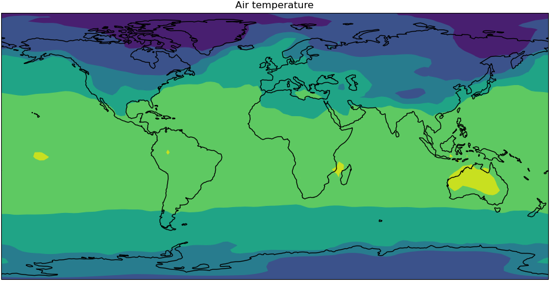

<!--  -->

This episode shows us how we can use ESMValTool in a Jupyter notebook. We are using material from a [short tutorial from EGU22][EGU22-tutorial]{:target="_blank"} 
and the [documentation][experimental-api]{:target="_blank"} which is a good place for further reference.



## Start a session in ARE
Log in to [ARE][are]{:target="_blank"} with your NCI account to start a JupyterLab session.
Refer to this [ARE setup guide]({{ page.root }}) for more details.
Open the folder to your hackathon folder in `nf33` where you can create a new notebook or use the 
`Intro_to_ESMValTool.ipynb` notebook in `CMIP7-Hackathon\exercises\Exercise4_files`

Let's start by importing the tool and some other tools we can use later. Note that we are importing from `esmvalcore` and calling
it `esmvaltool`.
```python
# Import the tool
import esmvalcore.experimental as esmvaltool

# Import tools for plotting
import matplotlib.pyplot as plt
import iris.quickplot
```

## Finding a recipe

There is a *utils* submodule we can use to find and get recipes. Call the `get_all_recipes()` function to get a
list of all available recipes from which you can use the `find()` method to return any matches. If you already know the
recipe you want you can use the `get_recipe()` function.
>## In Jupyter Notebook
> ```python
> all_recipes = esmvaltool.get_all_recipes()
> all_recipes
> ```
> ```python
> recipes.find('python') ## error
> ```
{: .solution}

> ## Get a recipe
> Let's use the `examples/recipe_python.yml` for this exercise, the documentation for it can be found 
> [here](https://docs.esmvaltool.org/en/latest/recipes/recipe_examples.html). Then see what's in the recipe metadata.
>
> > ## Solution
> > ```python
> > example_recipe = esmvaltool.get_recipe("examples/recipe_python.yml")
> > example_recipe
> > ```
> > For reading the recipe:
> > ```python
> > print(example_recipe.path.read_text())
> > ```
> > The `example_recipe` here is a Recipe class with attributes `data` and `name`, see the 
> > [reference][experimental-recipe]{:target="_blank"}.
> > ```python
> > example_recipe.name
> > # 'Recipe python'
> > ```
> {: .solution}
{: .challenge}

> ## Pro tip: remember the command line?
> This is another way of doing a similar thing from the command line:
> ```bash 
> >esmvaltool recipes get $recipeFile
> ```
{: .callout}

## Configuration in the notebook

We can look at the default user configuration file, `~/.esmvaltool/config-user.yml` 
by calling a `CFG` object as a dictionary. This gives us the ability to edit the settings.
The tool can automatically download the climate data files required to run a recipe for you.
You can check your download directory and output directory where your recipe runs will be saved.
This `CFG` object is from the `config` module in the ESMValCore API, for more details see [here][api-config].

> Check and ensure download directory exists
> > ## Solution
> > ```python
> > # call CFG object like this
> > esmvaltool.CFG
> > # then can access settings like a dictionary
> > esmvaltool.CFG['download_dir'].mkdir(exist_ok=True)
> > ```
> {: .solution}
> Check output directory and change
> > ## Solution
> > Check this location is your `\scratch\nf33\$USERNAME\esmvaltool_outputs\`
> > ```python
> > print(CFG['output_dir'])
> > # edit if required
> > # esmvaltool.CFG['output_dir'] = '/scratch/nf33/$USERNAME/esmvaltool_output'
> > ```
> {: .solution}
{: .challenge}


> ## Pro tip: Missing config file or load different config
> Rememeber that this command line copies and creates the default user configuration file
> in your home `.esmvaltool` folder:
> ```bash 
> esmvaltool config get-config-user
> ```
> 
> > ## Load a different configuration file to use
> > ```python
> > # an example path to other configuration file
> > CFG.load_from_file('/home/189/fc6164/esmValTool/config-fc-copy.yml')
> > ```
> {: .solution}
{: .callout}

## Running the recipe
Run the recipe and inspect the output.
> ## Run
> ```python
> output = example_recipe.run()
> output
> ```
> This may take some time and you will see some logging messages as it runs
> > ## Inspect output
> > ```output
> > map/script1:
> >   ImageFile('CMIP5_bcc-csm1-1_Amon_historical_r1i1p1_tas_2000-P1M.png')
> >   ImageFile('CMIP6_BCC-ESM1_Amon_historical_r1i1p1f1_tas_gn_2000-P1M.png')
> >   DataFile('CMIP5_bcc-csm1-1_Amon_historical_r1i1p1_tas_2000-P1M.nc')
> >   DataFile('CMIP6_BCC-ESM1_Amon_historical_r1i1p1f1_tas_gn_2000-P1M.nc')
> > 
> > timeseries/script1:
> >   ImageFile('tas_amsterdam_CMIP5_bcc-csm1-1_Amon_historical_r1i1p1_tas_1850-2000.png')
> >   ImageFile('tas_amsterdam_CMIP6_BCC-ESM1_Amon_historical_r1i1p1f1_tas_gn_1850-2000.png')
> >   ImageFile('tas_amsterdam_MultiModelMean_historical_Amon_tas_1850-2000.png')
> >   ImageFile('tas_global_CMIP5_bcc-csm1-1_Amon_historical_r1i1p1_tas_1850-2000.png')
> >   ImageFile('tas_global_CMIP6_BCC-ESM1_Amon_historical_r1i1p1f1_tas_gn_1850-2000.png')
> >   DataFile('tas_amsterdam_CMIP5_bcc-csm1-1_Amon_historical_r1i1p1_tas_1850-2000.nc')
> >   DataFile('tas_amsterdam_CMIP6_BCC-ESM1_Amon_historical_r1i1p1f1_tas_gn_1850-2000.nc')
> >   DataFile('tas_amsterdam_MultiModelMean_historical_Amon_tas_1850-2000.nc')
> >   DataFile('tas_global_CMIP5_bcc-csm1-1_Amon_historical_r1i1p1_tas_1850-2000.nc')
> >   DataFile('tas_global_CMIP6_BCC-ESM1_Amon_historical_r1i1p1f1_tas_gn_1850-2000.nc')
> > ```
> {: .solution}
{: .challenge}

> ## Pro tip: run a single Diagnostic
> To run a single diagnostic, the name of the task can be passed as an argument to `run()`
> ```python
> output_1 = example_recipe.run('map/script1')
> output_1
> ```
{: .callout}

## Recipe output
The output can return the files as well as the image files and data files,
also see the [reference page][experimental-output].
> Let's look through this recipe output.
> - Get the file paths.
> - Look at one of the plots.
> - Access and inspect the data used for the plots.
>
> > ## Solution
> > Print the file paths.
> > ```python
> > for result in output['map/script1']:
> >     print(result.path)
> > ```
> > Look at a plot from the list of plots.
> > ```python
> > plots = [f for f in output['timeseries/script1'] if isinstance(f, esmvaltool.recipe_output.ImageFile)]
> > plots[-1]
> > ```
> > Load one of the preprocessed data files.
> > ```python
> > data_files = [f for f in output['map/script1'] if isinstance(f, esmvaltool.recipe_output.DataFile)]
> > 
> > cube = data_files[0].load_iris()[0]
> > cube
> > ```
> {: .solution}
{: .challenge}

> ## Use the loaded data to make your own plot in your notebook.
>
> > ## Solution
> > ```python
> > # Create plot
> > iris.quickplot.contourf(cube)
> > 
> > # Set the size of the figure
> > plt.gcf().set_size_inches(12, 10)
> > 
> > # Draw coastlines
> > plt.gca().coastlines()
> > 
> > # Show the resulting figure
> > plt.show()
> > ```
> > 
> {: .solution}
{: .challenge}


