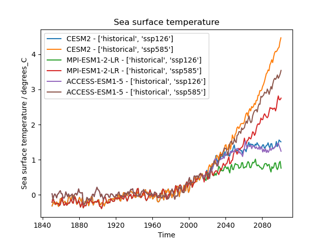

In this episode we will introduce the ESMValCore API in a jupyter notebook. This is reformatted from material from
this [blog post](https://blog.esciencecenter.nl/easy-ipcc-powered-by-esmvalcore-19a0b6366ea7){:target="_blank"}
by Peter Kalverla. There's also material from the [example notebooks][docs-notebooks]{:target="_blank"} and the
[API reference documentation][api-reference]{:target="_blank"}.


## Start ARE session
Log in to [ARE][are]{:target="_blank"} with your NCI account to start a JupyterLab session.
Refer to this [ARE setup guide]({{ page.root }}) for more details.
Open the folder to your hackathon folder in `nf33` where you can create a new notebook or use the 
`example_easyipcc.ipynb` notebook.

## Find Datasets with facets
We have seen from running available recipes that ESMValTool is able to find data from facets that were given in
the recipe. We can use this in a Notebook, including filling out the facets for data definition. 
To do this we will use the `Dataset` object from the API. Let's look at this example. 

```python
from esmvalcore.dataset import Dataset

dataset = Dataset(
    short_name='tos',
    mip='Omon',
    project='CMIP6',
    exp='historical',
    dataset='ACCESS-ESM1-5',
    ensemble='r4i1p1f1',
    grid='gn',
)
dataset.augment_facets()
print(dataset)
```
> ## Pro tip: Augmented facets in the output
> When running a recipe there is a `_filled` recipe in the output /run folder which augments the facets.
> > ## Example folder
> > ```output
> > esmvaltool_output/flato13ipcc_figure914_CMIP6_20240729_043707/run
> > ├── cmor_log.txt
> > ├── fig09-14
> > ├── flato13ipcc_figure914_CMIP6_filled.yml *
> > ├── flato13ipcc_figure914_CMIP6.yml
> > ├── main_log_debug.txt
> > ├── main_log.txt
> > └── resource_usage.txt
> > ```
> {: .solution}
{: .callout}

> ## Search available
> Search from files locally with wildcard functionality `'*'` to get the available datasets. 
> - How can you search for all available ensembles?
> 
> > ## Solution
> > ```python
> > from esmvalcore.config import CFG
> > 
> > CFG['search_esgf'] = 'always'
> > dataset_search = Dataset(
> >     short_name='tos',
> >     mip='Omon',
> >     project='CMIP6',
> >     exp='historical',
> >     dataset='ACCESS-ESM1-5',
> >     ensemble='*',
> >     grid='gn',
> > )
> > ensemble_datasets = list(dataset_search.from_files())
> > 
> > print([ds['ensemble'] for ds in ensemble_datasets])
> > ```
> {: .solution}
{: .challenge}

> ## Add supplementary variables
> Supplementary variables can be added to the `Dataset` object which can be used for certain 
> preprocessors such as area statistics and weighting. 
> - Add the area file to this Dataset.
>
> > ## Solution
> > ```python
> > # Discard augmented facets as they will be different for areacello
> > dataset = Dataset(**dataset.minimal_facets)
> > 
> > # Add areacello as supplementary dataset
> > dataset.add_supplementary(short_name='areacello', mip='Ofx')
> > 
> > # Autocomplete and inspect
> > dataset.augment_facets()
> > print(dataset.summary())
> > ```
> {: .solution}
{: .challenge}


> ## Loading the data and inspect
> 
> ```python
> # Before load, checks location of file
> print(dataset.files)
> 
> cube = dataset.load()
> cube
> ```
> > ## Output
> > ```output
> > sea_surface_temperature / (degC)          (time: 1980; cell index along second dimension: 300; cell index along first dimension: 360)
> >     Dimension coordinates:
> >         time                                   x                                        -                                      -
> >         cell index along second dimension      -                                        x                                      -
> >         cell index along first dimension       -                                        -                                      x
> >     Auxiliary coordinates:
> >         latitude                               -                                        x                                      x
> >         longitude                              -                                        x                                      x
> >     Cell measures:
> >         cell_area                              -                                        x                                      x
> >     Cell methods:
> >         0                                 area: mean where sea
> >         1                                 time: mean
> >     Attributes:
> >         Conventions                       'CF-1.7 CMIP-6.2'
> >         activity_id                       'CMIP'
> >         branch_method                     'standard'
> >         branch_time_in_child              0.0
> >         branch_time_in_parent             -594980
> >         cmor_version                      '3.4.0'
> >         data_specs_version                '01.00.30'
> >         experiment                        'all-forcing simulation of the recent past'
> >         experiment_id                     'historical'
> >         external_variables                'areacello'
> >         forcing_index                     1
> >         frequency                         'mon'
> >         further_info_url                  'https://furtherinfo.es-doc.org/CMIP6.CSIRO.ACCESS-ESM1-5.historical.no ...'
> >         grid                              'native atmosphere N96 grid (145x192 latxlon)'
> >         grid_label                        'gn'
> >         initialization_index              1
> >         institution                       'Commonwealth Scientific and Industrial Research Organisation, Aspendale, ...'
> >         institution_id                    'CSIRO'
> >         license                           'CMIP6 model data produced by CSIRO is licensed under a Creative Commons ...'
> >         mip_era                           'CMIP6'
> >         nominal_resolution                '250 km'
> >         notes                             "Exp: ESM-historical; Local ID: HI-08; Variable: tos (['sst'])"
> >         parent_activity_id                'CMIP'
> >         parent_experiment_id              'piControl'
> >         parent_mip_era                    'CMIP6'
> >         parent_source_id                  'ACCESS-ESM1-5'
> >         parent_time_units                 'days since 1850-1-1 00:00:00'
> >         parent_variant_label              'r1i1p1f1'
> >         physics_index                     1
> >         product                           'model-output'
> >         realization_index                 4
> >         realm                             'ocean'
> >         run_variant                       'forcing: GHG, Oz, SA, Sl, Vl, BC, OC, (GHG = CO2, N2O, CH4, CFC11, CFC12, ...'
> >         source                            'ACCESS-ESM1.5 (2019): \naerosol: CLASSIC (v1.0)\natmos: HadGAM2 (r1.1, ...'
> >         source_id                         'ACCESS-ESM1-5'
> >         source_type                       'AOGCM'
> >         sub_experiment                    'none'
> >         sub_experiment_id                 'none'
> >         table_id                          'Omon'
> >         table_info                        'Creation Date:(30 April 2019) MD5:40e9ef53d4d2ec9daef980b76f23d39a'
> >         title                             'ACCESS-ESM1-5 output prepared for CMIP6'
> >         variable_id                       'tos'
> >         variant_label                     'r4i1p1f1'
> >         version                           'v20200529'
> > ```
> {: .solution}
{: .challenge}

## Preprocessors
As mentioned in previous lessons, the idea of preprocessors are that they are a set of 
functions that can be applied in a centralised, documented and efficient way. There 
are a broad range of operations that are commonly done to input data before diagnostics 
or metrics are applied and can be done to all the datasets in a recipe consistently. 
See the [documentation][recipe-section-preprocessors]{:target="_blank"} to read further.

> ## Exercise: apply preprocessors using the API 
> See [API reference][api-preprocessors]{:target="_blank"} to check the 
> arguments for preprocessor functions. For this exercise, find; 
> 1. the global mean, 
> 2. then anomalies which we can get monthly, 
> 3. then aggregate to annual for plotting.
> 
> > ## Solution
> > ```python
> > from esmvalcore.preprocessor import annual_statistics, anomalies, area_statistics
> > 
> > # Set the reference period for anomalies 
> > reference_period = {
> >     "start_year": 1950, "start_month": 1, "start_day": 1,
> >     "end_year": 1979, "end_month": 12, "end_day": 31,
> > }
> > 
> > cube = area_statistics(cube, operator='mean')
> > cube = anomalies(cube, reference=reference_period, period='month')
> > cube = annual_statistics(cube, operator='mean')
> > cube.convert_units('degrees_C')
> > cube
> > ```
> > 
> > ```output
> > sea_surface_temperature / (degrees_C)     (time: 165)
> >     Dimension coordinates:
> >         time                                   x
> >     Auxiliary coordinates:
> >         year                                   x
> >     Scalar coordinates:
> >         cell index along first dimension  179, bound=(0, 359)
> >         cell index along second dimension 149, bound=(0, 299)
> >         latitude                          6.0 degrees_north, bound=(-78.0, 90.0) degrees_north
> >         longitude                         179.9867706298828 degrees_east, bound=(0.0, 359.9735412597656) degrees_east
> >     Cell methods:
> >         0                                 area: mean where sea
> >         1                                 time: mean
> >         2                                 latitude: longitude: mean
> >         3                                 year: mean
> > ```
> {: .solution}
{: .challenge}

## Custom code
We have so far solely used ESMValCore, however, you can use your own custom code and
being in a Notebook means you can try straight away. Now, continue with other libraries 
and make custom plots such as `xarray`.
```python
import xarray as xr
da = xr.DataArray.from_iris(cube)
da.plot()
print(da)
```
## Build workflow and diagnostic
> ## Exercise
> Let's pull some of these bits together to build a diagnostic.
> - using the `Dataset` object, make a template which we can use to find multiple
> datasets we want to analyse together.
> - the datasets being `"CESM2", "MPI-ESM1-2-LR", "IPSL-CM6A-LR"` and 
> experiments `'ssp126', 'ssp585'`, iterate to build a list of datasets.
> - apply the preprocessors to each dataset and plot the result
> 
> > ## Solution
> > ```python
> > import cf_units
> > import matplotlib.pyplot as plt
> > from iris import quickplot
> > 
> > from esmvalcore.config import CFG
> > from esmvalcore.dataset import Dataset
> > from esmvalcore.preprocessor import annual_statistics, anomalies, area_statistics
> > 
> > 
> > # Settings for automatic ESGF search
> > CFG['search_esgf'] = 'when_missing'
> > 
> > # Declare common dataset facets
> > template = Dataset(
> >     short_name='tos',
> >     mip='Omon',
> >     project='CMIP6',
> >     exp= '*', # We'll fill this below
> >     dataset='*',  # We'll fill this below
> >     ensemble='r4i1p1f1',
> >     grid='gn',
> > )
> > 
> > # Substitute data sources and experiments
> > datasets = []
> > for dataset_id in ["CESM2", "MPI-ESM1-2-LR", "IPSL-CM6A-LR"]:
> >     for experiment_id in ['ssp126', 'ssp585']:
> >         dataset = template.copy(dataset=dataset_id, exp=['historical', experiment_id])
> >         dataset.add_supplementary(short_name='areacello', mip='Ofx', exp='historical')
> >         dataset.augment_facets()
> >         datasets.append(dataset)
> > 
> > # Set the reference period for anomalies 
> > reference_period = {
> >     "start_year": 1950, "start_month": 1, "start_day": 1,
> >     "end_year": 1979, "end_month": 12, "end_day": 31,
> > }
> > 
> > # (Down)load, pre-process, and plot the cubes
> > for dataset in datasets: 
> >     cube = dataset.load()
> >     cube = area_statistics(cube, operator='mean')
> >     cube = anomalies(cube, reference=reference_period, period='month')  # notice 'month'
> >     cube = annual_statistics(cube, operator='mean')
> >     cube.convert_units('degrees_C')
> > 
> >     # Make sure all datasets use the same calendar for plotting
> >     tcoord = cube.coord('time')
> >     tcoord.units = cf_units.Unit(tcoord.units.origin, calendar='gregorian')
> > 
> >     # Plot
> >     quickplot.plot(cube, label=f"{dataset['dataset']} - {dataset['exp']}")
> > 
> > # Show the plot
> > plt.legend()
> > plt.show()
> > ```
> {: .solution}
{: .challenge}

> ## Pro tip: Convert to recipe
> We can use the helper to start making the recipe which we can use for reproducibility.
> ```python
> from esmvalcore.dataset import datasets_to_recipe
> import yaml
> 
> for dataset in datasets:
>     dataset.facets['diagnostic'] = 'easy_ipcc'
> print(yaml.safe_dump(datasets_to_recipe(datasets)))
> ```
> 
> > ## Output
> > ```yaml
> > datasets:
> > - dataset: ACCESS-ESM1-5
> >   exp:
> >   - historical
> >   - ssp126
> > - dataset: ACCESS-ESM1-5
> >   exp:
> >   - historical
> >   - ssp585
> > - dataset: CESM2
> >   exp:
> >   - historical
> >   - ssp126
> > - dataset: CESM2
> >   exp:
> >   - historical
> >   - ssp585
> > - dataset: MPI-ESM1-2-LR
> >   exp:
> >   - historical
> >   - ssp126
> > - dataset: MPI-ESM1-2-LR
> >   exp:
> >   - historical
> >   - ssp585
> > diagnostics:
> >   easy_ipcc:
> >     variables:
> >       tos:
> >         ensemble: r4i1p1f1
> >         grid: gn
> >         mip: Omon
> >         project: CMIP6
> >         supplementary_variables:
> >         - exp: historical
> >           mip: Ofx
> >           short_name: areacello
> >         timerange: 1850/2100
> > ```
> {: .solution}
{: .callout}


