
This is an introductory guide to setting up and using Microsoft Visual Studio Code (often referred to as VS Code) to interact with Gadi and run ESMValTool recipes for the ACCESS-NRI CMIP7-Hackathon.

## Pre-workshop preparation

- *0.1* In order to get the most out of the Hackathon, you will require a NCI account. If you do not yet have a NCI account, you can sign up on the [MyNCI website](https://my.nci.org.au).
- *0.2* To run the exercises, access to specific projects on Gadi is required. To help things run as smoothly as possible on the day, please log in to the [MyNCI website](https://my.nci.org.au) and join the following projects:
`nf33`, `xp65`, `fs38`, `oi10`, `al33`, `rr3`, `rt52`, `zz93` and `ct11` **prior** to attending the Hackathon. Please note it can take 1-2 days to receive membership approvals.
- *0.3* Download and install Microsoft Visual Studio Code on your local system. VS Code can be downloaded from [this page](https://code.visualstudio.com/).

## Installing VS Code extensions
Out of the box, VS Code doesn't do everything we need it to - so we must install some software extensions to get the most out of the Hackathon.

1. When VS Code starts up, you are greeted with a GUI that looks like this. The first thing we need to do is click the extensions icon in the left-hand navigation pane marked below with the red ellipse.

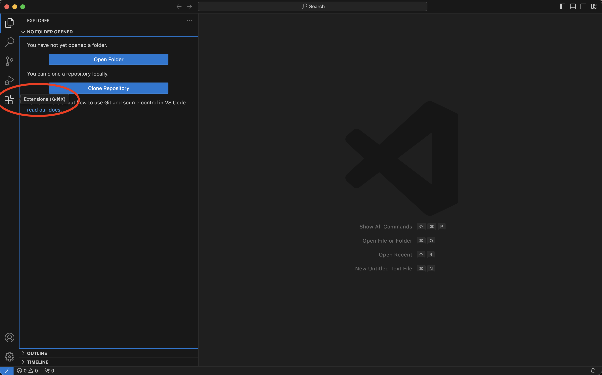

We have a total of 4 extensions to install. Note that when hovering over a listed extension, a small information pane pops up, and clicking on an extension opens a full extension information page.

- *Extension 1:* **Remote-SSH**  
This extension allows us to securely login to remote servers, in our case NCI Gadi, using *ssh*. Type `remote ssh` into the extensions search bar and select the *Remote-SSH* extension published by Microsoft marked with the red ellipse below. Click `install` to add the extension.

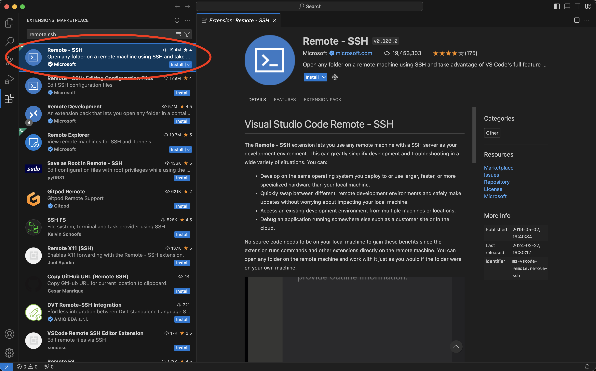

- *Extension 2:* **Live Server**  
Type `live server` into the extensions search bar and select the *Live Server* extension published by Ritwick Dey marked with the red ellipse below. This extension allows us to preview html files from a browser on our computer, and will update automatically as the html file is updated in VS Code. We will use this extension to preview some of the ESMValTool recipe outputs that come in html format. Click `install` to add the extension.

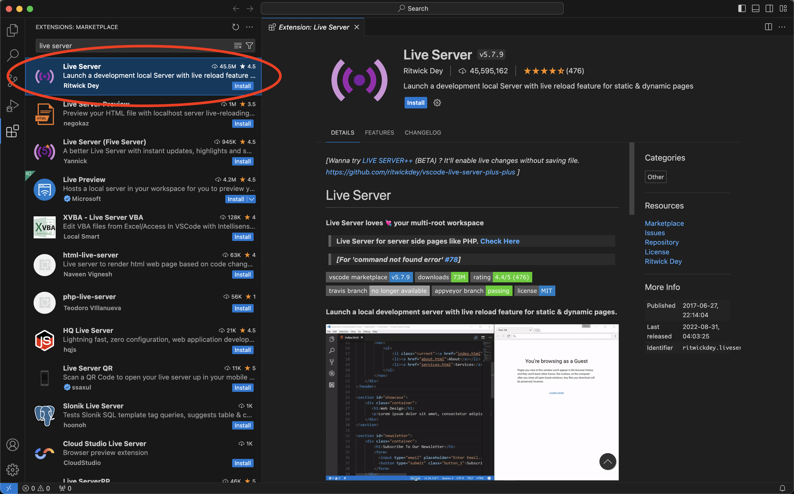

- *Extension 3:* **Python** *(Optional)*  
This extension provides full code support and highlighting for the *Python* programming language within VS Code. Type `python` into the extensions search bar and select the *Python* extension published by Microsoft marked with the red ellipse below. This extension will be helpful if you want to edit any Python files associated with ESMValTool recipes. Click `install` to add the extension.

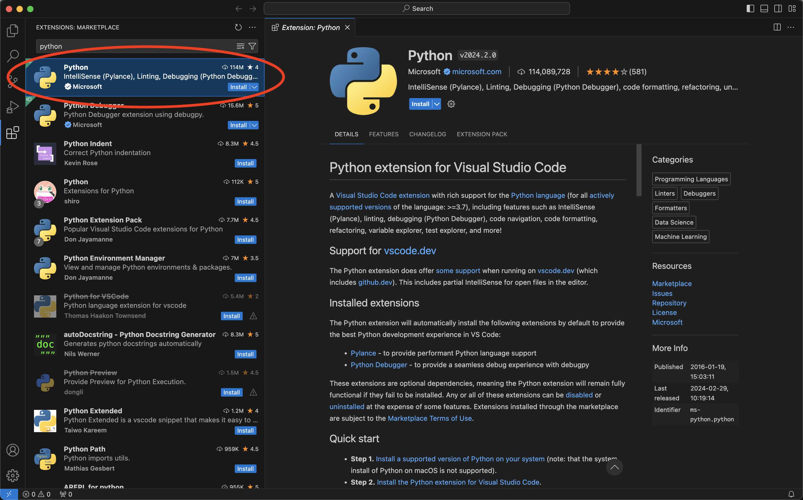

- *Extension 4:* **Jupyter** *(Optional)*  
This extension allows us to view, edit and run *Jupyter Notebooks* within VS Code. Type `jupyter` into the extensions search bar and select the *Jupyter* extension published by Microsoft marked with the red ellipse below. This extension will be helpful if you prefer to use Jupyter Notebooks when editing code in VS Code. Click `install` to add the extension.

[\[Back to top\]](https://github.com/ACCESS-NRI/CMIP7-Hackathon/blob/main/docs/1_VSCode_setup_guide_RECOMMENDED.md#getting-started-guide-for-visual-studio-code-vs-code)

## Open remote connection to Gadi

To connect to Gadi, follow these steps to establish and open a remote connection using the *Remote-SSH* extension.

- *2.1* To get started, click the blue `Open a Remote Window` button in the bottom left-hand corner.

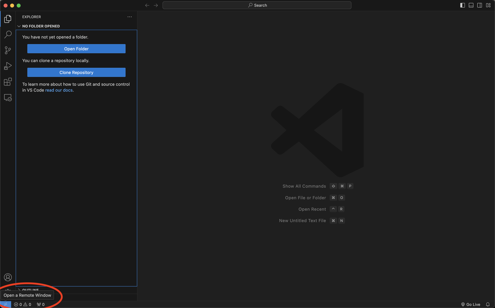

- *2.2* Select `Connect Current Window to Host...` to open the connection to Gadi within the current window. Alternatively, you can select `Connect to Host...` to open the connection in a new window.

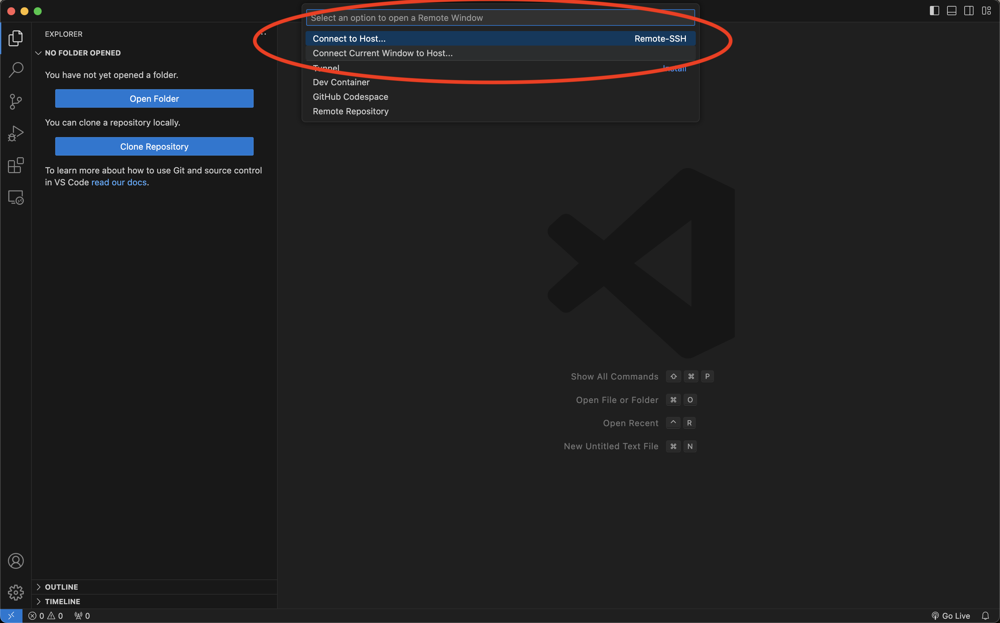

- *2.3* Click `+ Add New SSH Host`

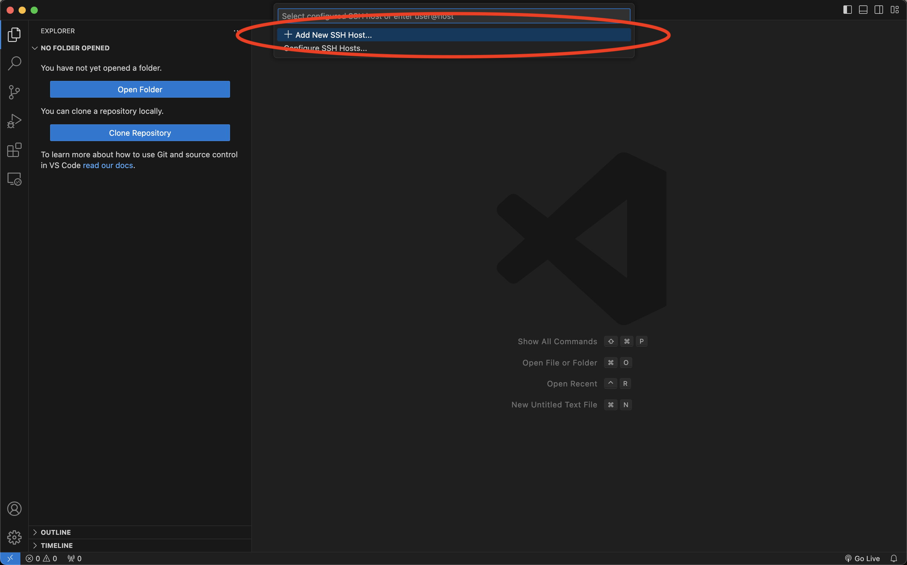

- *2.4* Enter the remote host (Gadi) details which are comprised of your NCI `username` followed by `@gadi.nci.org.au`. You may be prompted to select a _ssh_ `config` file so VS Code can remember your _ssh_ connections in future. VS Code will automatically create a config file for you, so usually selecting the first default option that appears will work fine as VS Code will manage the file.

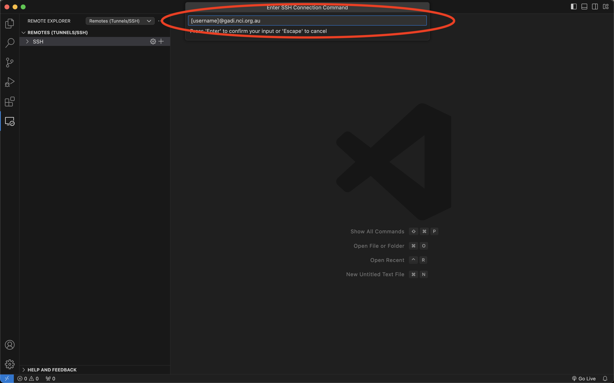

N.B. You can have multiple host connections can exist in your config file with the same name (`gadi.nci.org.au` for example). To rename these you must open the config file selected in step 2.4 by first clicking `Configure SSH Hosts...`

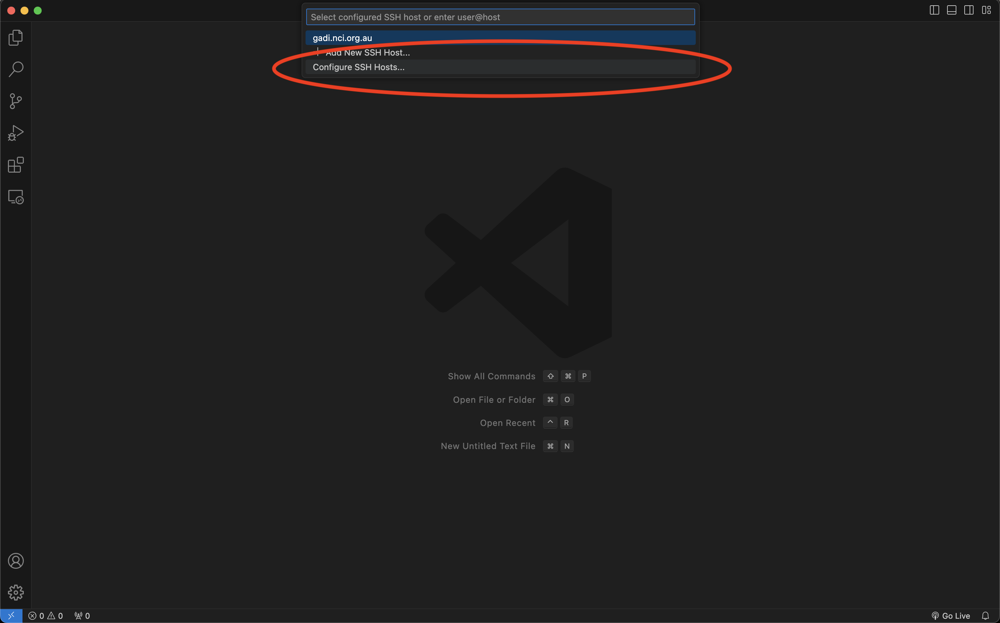

You can then change the text next to the `Host` tag to any unique string that does not contain spaces. In example below, each host name string has been renamed to unique values.

- *2.5* You will then be prompted to enter your NCI account password. Once connected, the blue button in the bottom left-hand corner will say `SSH: gadi.nci.org.au`. VS Code also automatically opens a live terminal (bottom right) in your `/home` folder. Great news, you are now connected to Gadi!

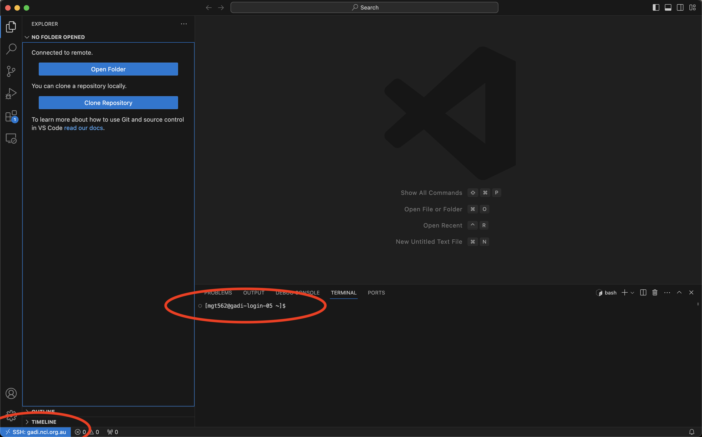

[\[Back to top\]](https://github.com/ACCESS-NRI/CMIP7-Hackathon/blob/main/docs/1_VSCode_setup_guide_RECOMMENDED.md#getting-started-guide-for-visual-studio-code-vs-code)

## Load ESMValTool modules and set up Hackathon environment

You can now follow the instructions in the [README](https://github.com/ACCESS-NRI/CMIP7-Hackathon/blob/main/README.md) for how to setup your environment to run ESMValTool and how to use ESMValTool recipes. To continue to Step 4 below, you must have at least run the steps under the heading [Set up our environment to run ESMValTool](https://github.com/paigem/CMIP7-Hackathon/blob/main/README.md#set-up-our-environment-to-run-esmvaltool), as these steps will create the folders that we will open below.

[\[Back to top\]](https://github.com/ACCESS-NRI/CMIP7-Hackathon/blob/main/docs/1_VSCode_setup_guide_RECOMMENDED.md#getting-started-guide-for-visual-studio-code-vs-code)

## Create a workspace / open folders on Gadi

VS Code allows you to create custom workspaces, which is particularly convenient for quick access to multiple directories/folders on Gadi which may be located in different locations.

- *4.1* To add a directory/folder to the current workspace, simply click the `Open Folder` button marked in red below. Alternatively, you can also add folders via `File > Open Folder`.

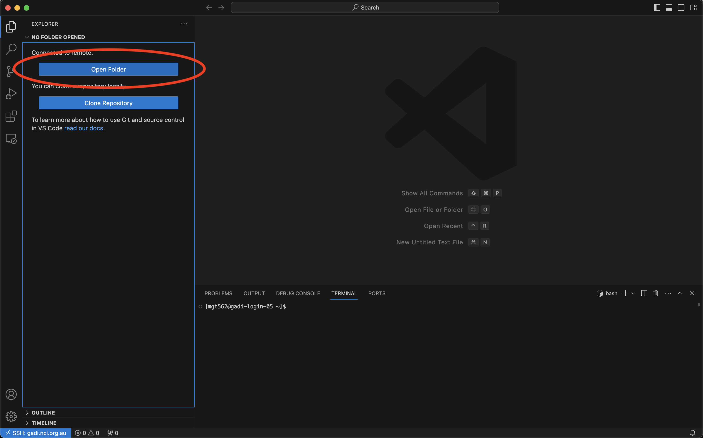

- *4.2* You will then be prompted to add a valid path on Gadi to the folder you wish to add. In this example, we are adding the path to your main Hackathon folder `/scratch/nf33/[username]/CMIP7-Hackathon` created by running `check_hackathon` above. Once you have entered the path, press `OK`. N.B. When adding a folder, VS Code may request you re-enter your NCI account password.

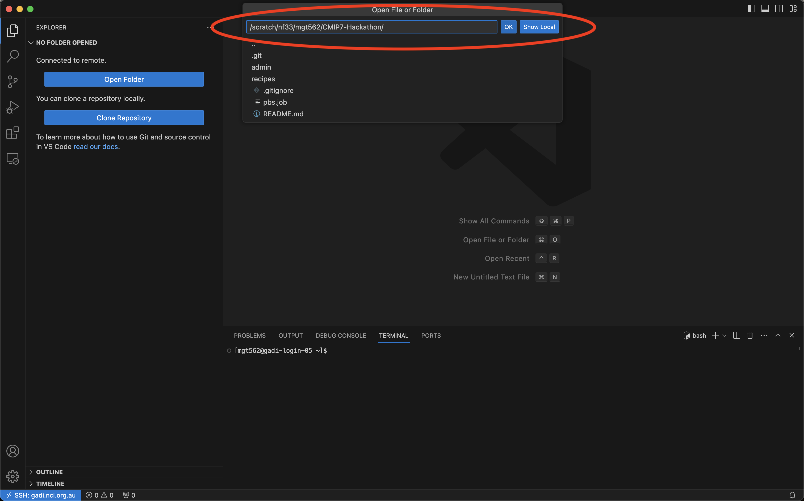

Once this is done, the folder will be visible in the left-hand `EXPLORER` pane (and can be expanded to show all contents), it is also displayed at the top of page in the search bar (allowing quick searches of the selected folder), and the terminal also opens in the selected folder (the `ls` command is shown here to list the folder contents).

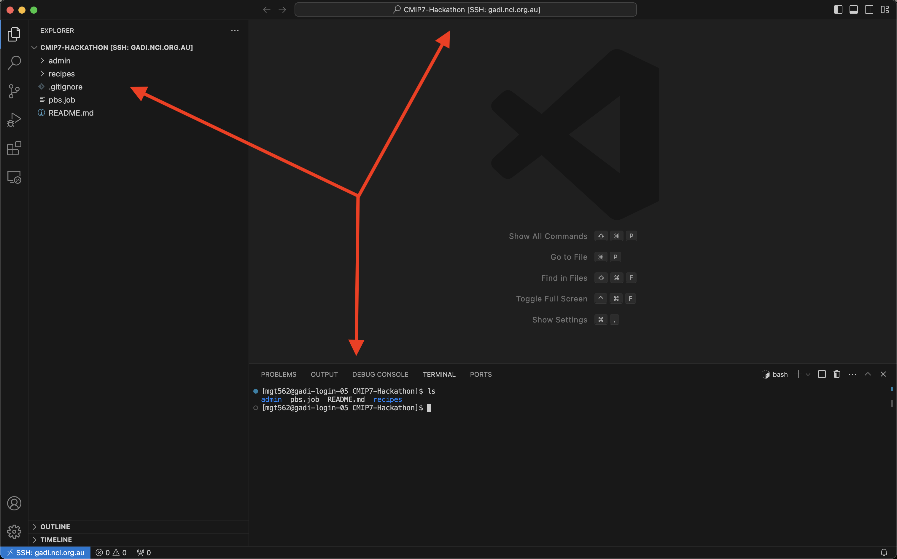

You can add multiple unique folders to the current workspace by right clicking and selecting `Add folder to Workspace` and following the process described above in section 4.2.

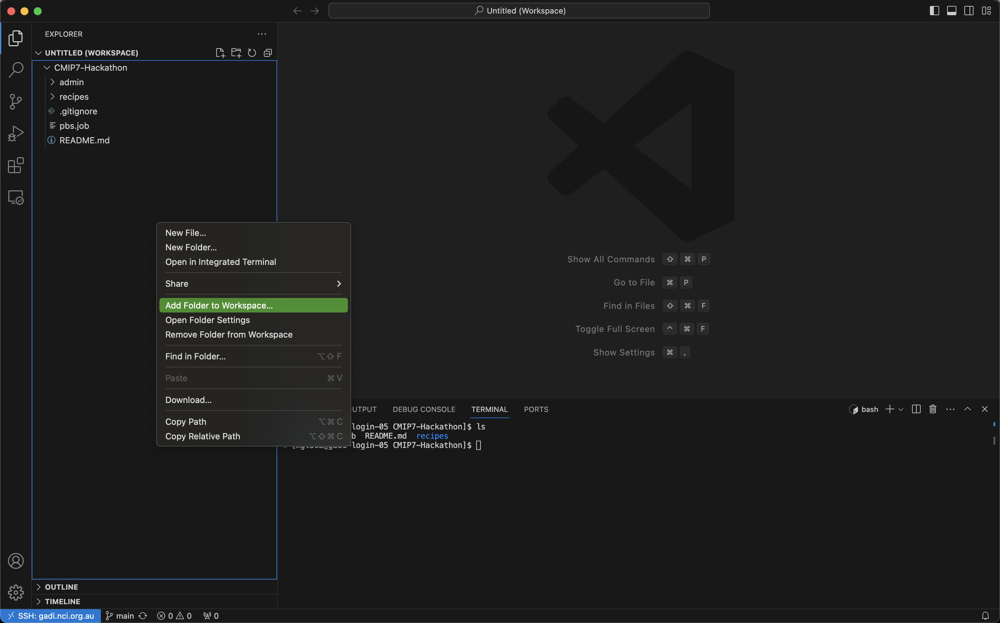

Now that you have a workspace setup, we suggest adding the above mentioned `esmvaltool_outputs` and `logs` folders (replacing [username] with your NCI account username) for quick access.

[\[Back to top\]](https://github.com/ACCESS-NRI/CMIP7-Hackathon/blob/main/docs/1_VSCode_setup_guide_RECOMMENDED.md#getting-started-guide-for-visual-studio-code-vs-code)

## VS Code extras

To open any supported file(s), you can double click it in the left-hand `EXPLORER` pane or drag-and-drop it into the main panel. To add a second main panel, right-click any extra files in `EXPLORER` and select `Open to the Side`.

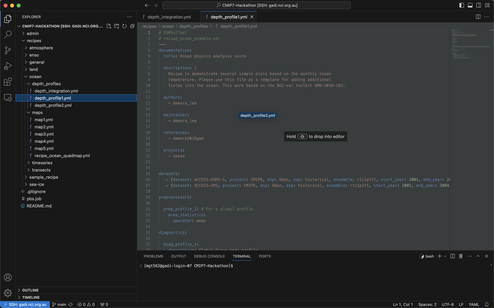

Along with folders in a workspace, you can also have multiple independent terminal sessions running at the same time. To do this, click the `+` button at the top right of a terminal panel.
 
 
If you have multiple folders open in your workspace, you will first be prompted to `Select current working directory for new terminal` at the top.

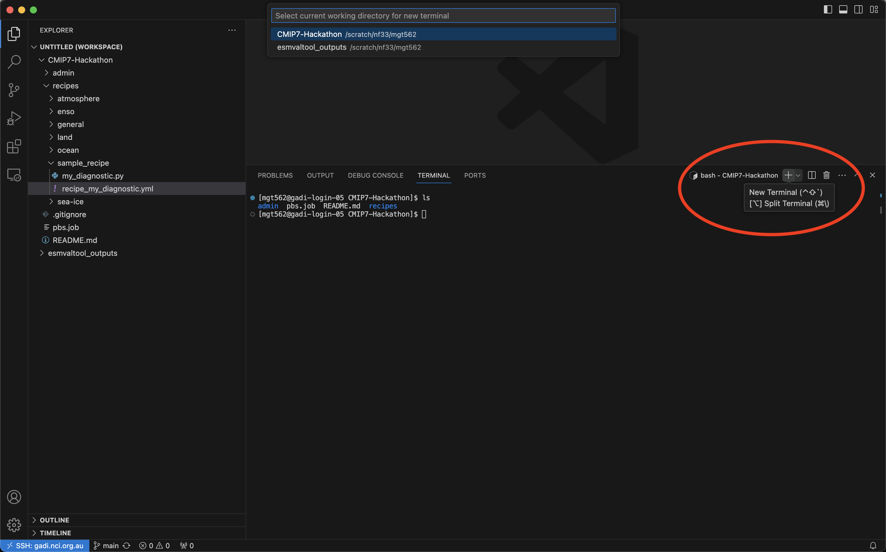

[\[Back to top\]](https://github.com/ACCESS-NRI/CMIP7-Hackathon/blob/main/docs/1_VSCode_setup_guide_RECOMMENDED.md#getting-started-guide-for-visual-studio-code-vs-code)
