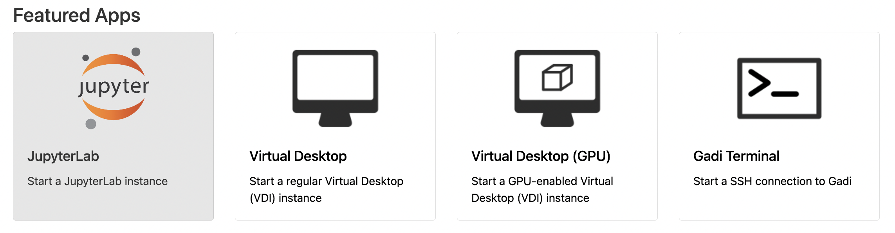
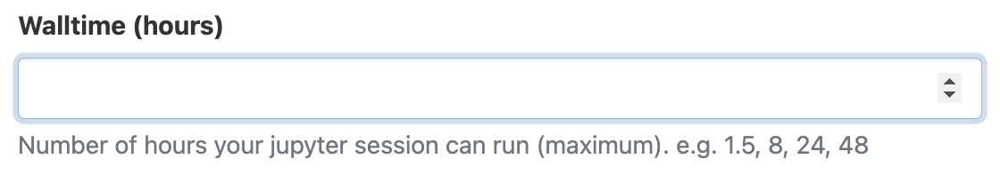
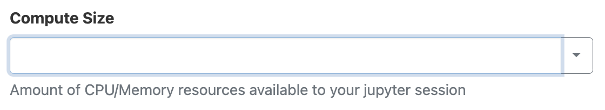
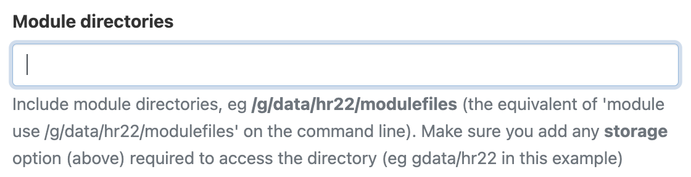
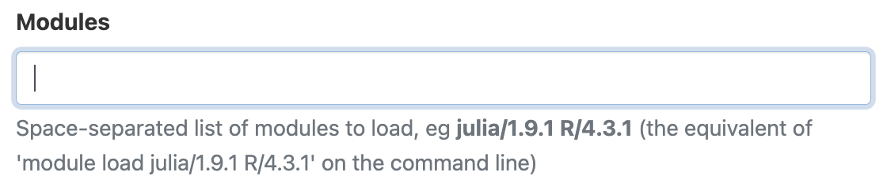
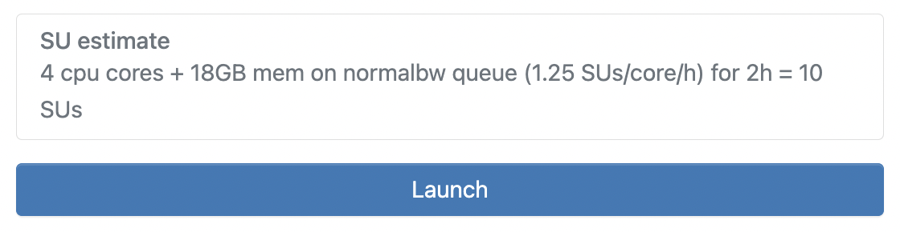
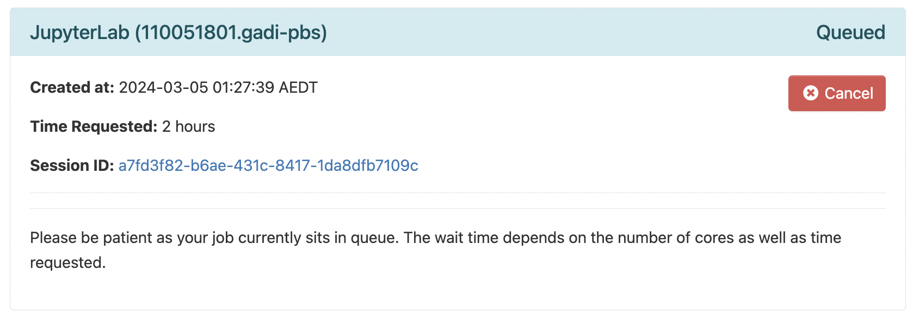
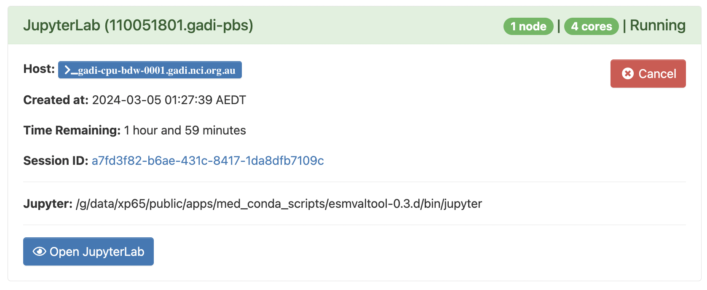
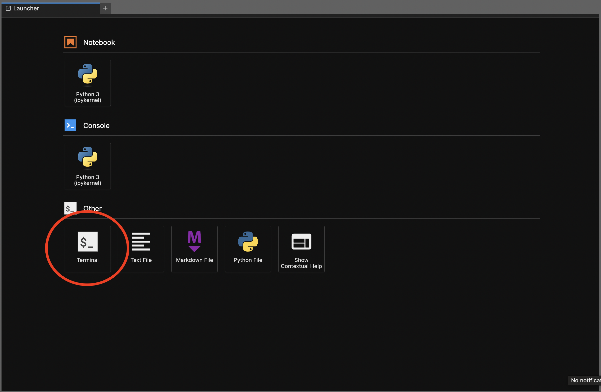

<p>Quick-start guide to setting up a JupyterLab session using the Australian Research Environment  to run the ACCESS-NRI CMIP7-Hackathon exercises.</p>

## Pre-workshop preparation

1. In order to get the most out of the Hackathon, you will require a NCI account. If you do not yet have a NCI account, you can sign up on the [MyNCI website](https://my.nci.org.au).
2. To run the exercises, access to specific projects on Gadi is required. To help things run as smoothly as possible on the day, please log in to the [MyNCI website](https://my.nci.org.au) and join the following projects:
`nf33`, `xp65`, `fs38`, `oi10`, `al33`, `rr3`, `rt52`, `zz93` and `ct11` **prior** to attending the Hackathon. Please note it can take 1-2 days to receive membership approvals.

## Open ARE on Gadi
Go to the [Australian Research Environment](https://are-auth.nci.org.au/) website and login with your **NCI username and password**. If you don't have an NCI account, you can sign up for one at the [MyNCI website](https://my.nci.org.au).

<p align="center"></p>

## Start JupyterLab App
Click on `JupyterLab` under *Featured Apps* to configure a new JupyterLab instance. This option is also available under the *All Apps* section at the bottom of the page and the *Interactive Apps* dropdown located in the top menu.

<p align="center"></p>

## Configure JupyterLab session
You will now be presented with the main JupyterLab instance configuration form. Please complete **only** the fields below - leave all other fields blank or to their default values.

1. **Walltime**: The number of hours the JupyterLab instance will run. For the hackathon, please insert a walltime of `4` hours.

<p align="center"></p>

2. **Compute Size**: Select `Medium (4 cpus, 18G mem)` from the dropdown menu.

<p align="center"></p>

3. **Project**: Please enter `nf33`. This will allocate SU usage to the workshop project.

<p align="center"></p>

4. **Storage**: This is the list of project data storage locations required to complete the hackathon exercises. In ARE, storage locations need to be explicitly defined to access these data from within a JupyterLab instance. Please copy and paste the following string in its entirety into the storage input field:
```
scratch/nf33+gdata/nf33+gdata/xp65+gdata/fs38+gdata/oi10+gdata/al33+gdata/rr3+gdata/rt52+gdata/zz93+gdata/ct11
```

<p align="center"></p>

5. Click `Advanced options ...`
  * Optional: You can check the box here to receive an email notification when your JupyterLab instance starts, but as we are running a relatively small instance, it will likely spin up quickly so this probably isn't necessary.</p>

6. **Module directories**: To load the required environment modules, please copy and paste the following. This is equivalent to using `module use` on the command line.
```
/g/data/xp65/public/modules
```

<p align="center"></p>

7. **Modules** To load the ESMValTool-workflow environment, please copy and paste the following. This is equivalent to using `module load` on the command line.
```
esmvaltool
```

<p align="center"></p>

8. Click `Launch` to start your JupyterLab instance.


<p align="center"></p>


## Launch JupyterLab session
Once you have clicked `Launch` the browser will redirect to the 'interactive sessions' page where you will see your JupyterLab instance details and current status which will look something like this:

<p align="center"></p>

Once the JupyterLab instance has started (this usually takes around 30 seconds), this status window should update and look something like the following, reporting that the instance has started and the time remaining. More detailed information on the instance can be accessed by clicking the `Session ID` link.

<p align="center"></p>

Click `Open JupyterLab`. This opens the instance in a new browser window where you can navigate to the location of the cloned tutorial files.


## Setup Hackathon ESMValTool environment
To finalise the system setup, we must run the hackathon setup script. This verifies that your NCI account has access to the required projects on Gadi and that their respective storage locations are mounted, clones the [CMIP7-Hackathon Github repository](https://github.com/ACCESS-NRI/CMIP7-Hackathon), and automatically runs each of the hackathon ESMValTool recipes as PBS jobs on Gadi.

To do this within ARE, from the `Launcher` window we must first open `Terminal`:

<p align="center"></p>

Once the terminal is open, insert the following command and press `ENTER/RETURN`:

```
check_hackathon
```

When successful, you will see a range of checks and processes print to the screen, which may take up to 1 minute to complete. Once you see the "YOU ARE ALL SET!!!" message, everything is setup and ready to go.

