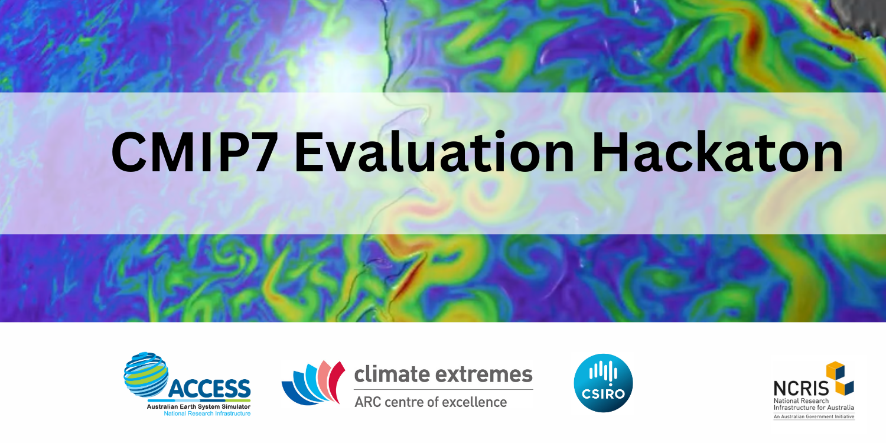

  

Welcome to the second CMIP7 Evaluation Hackathon, following our successful event held in March this year. This hackathon will focus on the evaluation frameworks developed by ACCESS-NRI. Our aim is to provide you with a comprehensive overview of the tools available for climate model evaluation, including ILAMB and ESMValTool, and to familiarize you with the relevant datasets.

Throughout the day, you will engage in a series of hands-on exercises designed to deepen your understanding of evaluation frameworks, including how to run and write recipes and use Jupyter notebooks to interact with ESMValTool. We hope these activities will enhance your skills and knowledge, and facilitate more effective evaluation of climate models.

Thank you for joining us, and we look forward to a productive and insightful workshop.

## Workshop Instructors

    

        
        
Romain Beucher

        
Team Lead

    

    

        
        
Felicity Chun

        
Research Software Engineer

    

    

        
        
Rhaegar Zeng

        
Research Software Engineer

    

> ## What will you learn in this course
>
> - What is ESMValTool / What is the ACCESS ESMValTool-Workflow
> - What is ILAMB / What is the ACCESS ILAMB-Workflow
> - How to run an ESMValTool recipe on NCI-Gadi using the ESMValTool-Workflow
> - How to run ILAMB using the ILAMB-Workflow
> - What are the data supported on Gadi?
> - How to develop your own recipes.
> - How to develop your own diagnostics.
> - How to find support.
>
{: .checklist}

> ## Prerequisites
>
> The prerequisites for the tutorial are listed on the
> [Setup page]({{ page.root }}).
> Please make sure you go through the pre-requisites before attending the Hackathon.
>
{: .prereq}


